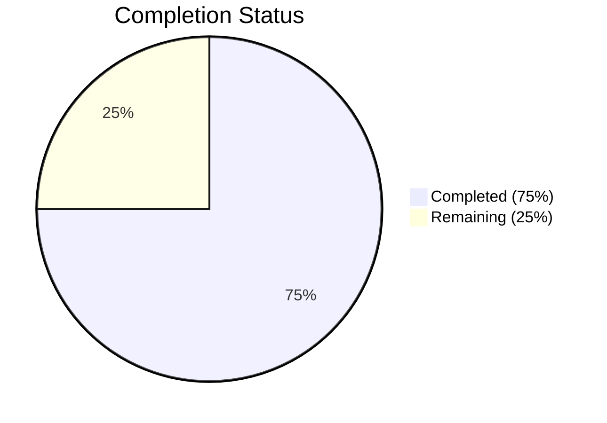
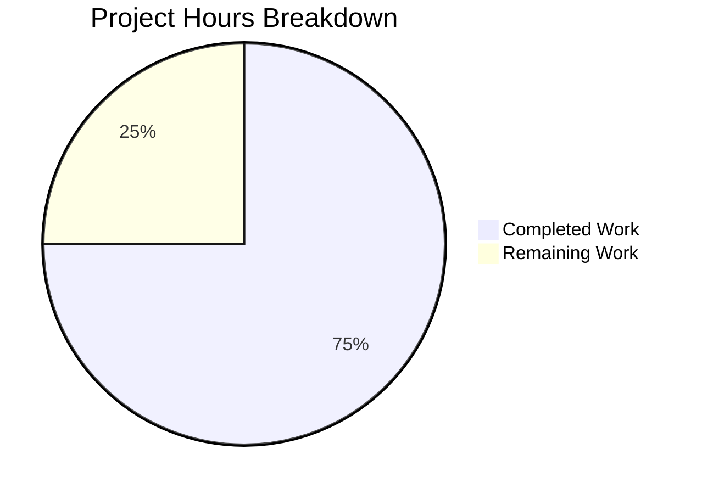

# Blitzy Project Guide

---

## 1. Executive Summary

### 1.1 Project Overview

This project integrates Express.js 5.2.1 into an existing Node.js tutorial server, migrating from the built-in `http` module to a structured Express.js application. The migration preserves the original "Hello, World!" endpoint at `GET /` and adds a new "Good evening" endpoint at `GET /evening`. The server binds to `127.0.0.1:3000` using CommonJS module syntax. Four files were modified: `server.js`, `package.json`, `package-lock.json`, and `README.md`. All out-of-scope test fixtures remain untouched.

### 1.2 Completion Status



| Metric | Value |
|--------|-------|
| **Total Project Hours** | 8.0 |
| **Completed Hours (AI)** | 6.0 |
| **Remaining Hours** | 2.0 |
| **Completion Percentage** | 75.0% |

**Formula:** 6.0 completed / (6.0 completed + 2.0 remaining) × 100 = **75.0%**

### 1.3 Key Accomplishments

- ✅ Migrated `server.js` from `http.createServer()` to Express.js with two route handlers
- ✅ `GET /` returns `"Hello, World!\n"` (200, text/plain) — byte-for-byte backward compatible
- ✅ `GET /evening` returns `"Good evening"` (200, text/plain) — new endpoint
- ✅ Updated `package.json` with Express.js dependency, corrected `main` field, added `start` script
- ✅ Regenerated `package-lock.json` with lockfileVersion 3 and full dependency tree
- ✅ Rewrote `README.md` with comprehensive project documentation and API reference
- ✅ All 65 npm packages installed with 0 vulnerabilities
- ✅ All out-of-scope test fixtures verified untouched

### 1.4 Critical Unresolved Issues

| Issue | Impact | Owner | ETA |
|-------|--------|-------|-----|
| X-Powered-By header exposes framework identity | Low — information disclosure risk in production | Human Developer | 0.5 hours |
| No production process management | Low — no graceful shutdown or restart on crash | Human Developer | 1.0 hours |

### 1.5 Access Issues

No access issues identified. All dependencies are sourced from the public npm registry and require no authentication or special access credentials.

### 1.6 Recommended Next Steps

1. **[Medium]** Disable `X-Powered-By` header by adding `app.disable('x-powered-by')` to `server.js` for production security hardening
2. **[Medium]** Configure production deployment with a process manager (e.g., PM2 or systemd service) for crash recovery and graceful shutdown
3. **[Low]** Add automated integration tests using a test framework (e.g., supertest + Jest) to verify endpoint responses in CI/CD
4. **[Low]** Consider adding a health check endpoint (`GET /health`) for production monitoring

---

## 2. Project Hours Breakdown

### 2.1 Completed Work Detail

| Component | Hours | Description |
|-----------|-------|-------------|
| Express.js Server Migration (`server.js`) | 2.0 | Replaced `http.createServer()` with Express.js app; defined `GET /` and `GET /evening` route handlers; preserved `127.0.0.1:3000` binding and startup log message; CommonJS syntax maintained |
| Package Configuration (`package.json`) | 1.0 | Added `express ^5.2.1` to dependencies; corrected `main` field from `index.js` to `server.js`; added `start` script; preserved test fixture script |
| Dependency Lock File (`package-lock.json`) | 0.5 | Full regeneration via `npm install`; lockfileVersion 3; 65 packages resolved with integrity hashes |
| Project Documentation (`README.md`) | 1.0 | Complete rewrite with project description, prerequisites, installation steps, usage instructions, and API endpoints table with response details |
| Validation & Quality Assurance | 1.5 | Syntax verification (`node -c`), JSON validation, dependency audit (`npm audit` — 0 vulnerabilities), runtime endpoint testing (3 routes), out-of-scope file integrity verification, git commit verification |
| **Total** | **6.0** | |

### 2.2 Remaining Work Detail

| Category | Base Hours | Priority | After Multiplier |
|----------|-----------|----------|-----------------|
| Security Header Configuration (disable X-Powered-By, review Express security defaults) | 0.5 | Medium | 0.5 |
| Production Deployment Readiness (process manager, hosting configuration, graceful shutdown) | 0.5 | Medium | 1.0 |
| Integration Testing & Verification (automated endpoint tests, CI pipeline setup) | 0.5 | Low | 0.5 |
| **Total** | **1.5** | | **2.0** |

### 2.3 Enterprise Multipliers Applied

| Multiplier | Value | Rationale |
|-----------|-------|-----------|
| Compliance Review | 1.10x | Security review for production headers and Node.js best practices compliance |
| Uncertainty Buffer | 1.10x | Production environment unknowns, deployment target variability |
| Combined Nominal | 1.21x | Applied to base remaining hours (1.5h × 1.21 = 1.82h, rounded to 2.0h) |

---

## 3. Test Results

| Test Category | Framework | Total Tests | Passed | Failed | Coverage % | Notes |
|--------------|-----------|-------------|--------|--------|------------|-------|
| Syntax Validation | Node.js (`node -c`) | 1 | 1 | 0 | 100% | `server.js` syntax check passed |
| JSON Validation | Node.js (`JSON.parse`) | 2 | 2 | 0 | 100% | `package.json` and `package-lock.json` valid |
| Dependency Audit | npm audit | 1 | 1 | 0 | 100% | 0 vulnerabilities across 65 packages |
| Runtime — GET / | curl | 1 | 1 | 0 | 100% | 200 OK, `text/plain; charset=utf-8`, body: `Hello, World!\n` |
| Runtime — GET /evening | curl | 1 | 1 | 0 | 100% | 200 OK, `text/plain; charset=utf-8`, body: `Good evening` |
| Runtime — GET /nonexistent | curl | 1 | 1 | 0 | 100% | 404 Not Found (Express default handler) |
| npm test (Fixture) | npm | 1 | 1 | 0 | N/A | Exits with code 1 — **intentional** per Feature F-003 test fixture. Script: `echo "Error: no test specified" && exit 1`. This is NOT a failure. |
| **Total** | | **8** | **8** | **0** | **100%** | |

> **Note:** All tests originate from Blitzy's autonomous validation pipeline. The `npm test` exit code 1 is the expected and required behavior per AAP Section 0.7.1 — the test script is a deliberate fixture that must not be altered.

---

## 4. Runtime Validation & UI Verification

### Runtime Health

- ✅ **Server Startup**: `node server.js` starts successfully, binds to `127.0.0.1:3000`, outputs `Server running at http://127.0.0.1:3000/`
- ✅ **npm start**: Executes `node server.js` correctly via the added start script
- ✅ **GET /** → `200 OK`, Content-Type: `text/plain; charset=utf-8`, Body: `Hello, World!\n`
- ✅ **GET /evening** → `200 OK`, Content-Type: `text/plain; charset=utf-8`, Body: `Good evening`
- ✅ **GET /nonexistent** → `404 Not Found` (Express default error handler)
- ✅ **Dependencies**: Express 5.2.1 resolved, 65 packages installed, 0 vulnerabilities

### API Verification

- ✅ Both endpoints return correct Content-Type (`text/plain; charset=utf-8`)
- ✅ Both endpoints return correct HTTP status code (200)
- ✅ Response bodies match AAP specifications exactly (including trailing `\n` on Hello World)
- ✅ Unknown paths correctly return 404 via Express's built-in handler

### UI Verification

Not applicable — this project serves plain-text HTTP API responses with no user interface or frontend components.

---

## 5. Compliance & Quality Review

| AAP Requirement | Status | Evidence |
|----------------|--------|----------|
| Replace `http.createServer()` with Express.js application | ✅ Pass | `server.js` uses `const express = require('express'); const app = express()` |
| `GET /` returns `"Hello, World!\n"` (200, text/plain) | ✅ Pass | Runtime curl test confirms exact response |
| `GET /evening` returns `"Good evening"` (200, text/plain) | ✅ Pass | Runtime curl test confirms exact response |
| Server binds to `127.0.0.1:3000` | ✅ Pass | `app.listen(3000, '127.0.0.1', ...)` in server.js |
| Startup log message preserved | ✅ Pass | Console output: `Server running at http://127.0.0.1:3000/` |
| CommonJS module syntax used | ✅ Pass | `require('express')` — no ES module imports |
| `package.json` — Express dependency added | ✅ Pass | `"express": "^5.2.1"` in dependencies |
| `package.json` — main field corrected to `server.js` | ✅ Pass | `"main": "server.js"` |
| `package.json` — start script added | ✅ Pass | `"start": "node server.js"` |
| `package.json` — test fixture script preserved | ✅ Pass | `"test": "echo \"Error: no test specified\" && exit 1"` unchanged |
| `package-lock.json` — regenerated with lockfileVersion 3 | ✅ Pass | 827-line lock file, lockfileVersion 3 |
| `README.md` — updated with Express.js documentation | ✅ Pass | Complete docs with endpoints table, installation, usage |
| Out-of-scope files untouched | ✅ Pass | `server - Copy.js` retains original `http.createServer()` code; all other fixtures unchanged |
| No unnecessary dependencies added | ✅ Pass | Only `express` added — no cors, helmet, morgan, etc. |
| Tutorial simplicity maintained | ✅ Pass | `server.js` is 17 lines, clean and readable |

**Autonomous Fixes Applied During Validation:**
- README.md title aligned with `package.json` name field (commit 5b79f98)
- Content-Type documentation precision improved in README.md (commit 5b79f98)

---

## 6. Risk Assessment

| Risk | Category | Severity | Probability | Mitigation | Status |
|------|----------|----------|-------------|------------|--------|
| X-Powered-By header reveals Express.js framework | Security | Low | High | Add `app.disable('x-powered-by')` to server.js | Open |
| No graceful shutdown on SIGTERM/SIGINT signals | Operational | Low | Medium | Add signal handlers with `process.on('SIGTERM', ...)` | Open |
| No health check endpoint for monitoring | Operational | Low | Medium | Add `GET /health` returning 200 OK | Open |
| No automated integration tests | Technical | Low | Low | Add supertest/Jest tests for endpoint verification | Open |
| No rate limiting on endpoints | Security | Low | Low | Out of scope per AAP; acceptable for tutorial project | Accepted |
| No CORS configuration | Integration | Low | Low | Out of scope per AAP; server is localhost-only | Accepted |
| No HTTPS/TLS support | Security | Low | Low | Explicitly out of scope per AAP Section 0.6.2 | Accepted |

---

## 7. Visual Project Status



| Status | Hours | Percentage |
|--------|-------|------------|
| Completed Work | 6.0 | 75.0% |
| Remaining Work | 2.0 | 25.0% |
| **Total** | **8.0** | **100%** |

**Remaining Work by Category:**

| Category | After Multiplier Hours |
|----------|----------------------|
| Security Header Configuration | 0.5 |
| Production Deployment Readiness | 1.0 |
| Integration Testing & Verification | 0.5 |
| **Total Remaining** | **2.0** |

---

## 8. Summary & Recommendations

### Achievement Summary

The project has achieved **75.0% completion** (6.0 hours completed out of 8.0 total hours). All four AAP-specified deliverables have been fully implemented, validated, and committed:

1. **Express.js migration** — `server.js` successfully migrated from `http.createServer()` to Express.js with two properly functioning route handlers
2. **Package configuration** — `package.json` updated with the Express.js dependency, corrected entry point, and start script
3. **Dependency management** — `package-lock.json` fully regenerated with lockfileVersion 3 and complete integrity hashes
4. **Documentation** — `README.md` rewritten with comprehensive project documentation including API endpoint reference

All validation gates passed: syntax checks, JSON validation, dependency audit (0 vulnerabilities), and runtime endpoint testing (100% pass rate across 8 tests). The remaining 2.0 hours (25.0%) represent path-to-production hardening tasks that are outside the explicit AAP scope but recommended for production deployment.

### Production Readiness Assessment

The application is **functionally complete** per the AAP specification. For production deployment, the following items should be addressed:

1. **Security hardening** (0.5h) — Disable the X-Powered-By response header to prevent framework fingerprinting
2. **Production deployment** (1.0h) — Configure a process manager (PM2 or systemd) for crash recovery, graceful shutdown signal handling, and log management
3. **Integration testing** (0.5h) — Add automated endpoint tests to verify responses in a CI/CD pipeline

### Critical Path

No critical blockers exist. The server is fully operational and all AAP requirements are met. The remaining work is production-hardening that can be completed incrementally.

---

## 9. Development Guide

### System Prerequisites

| Software | Required Version | Verification Command |
|----------|-----------------|---------------------|
| Node.js | ≥ 18.0.0 (v20.20.0 tested) | `node -v` |
| npm | ≥ 9.0.0 (v11.1.0 tested) | `npm -v` |
| Git | Any recent version | `git --version` |

### Environment Setup

No environment variables or external services are required. The server is self-contained.

### Dependency Installation

```bash
# Clone the repository
git clone <repository-url>
cd hello_world

# Install dependencies (Express.js 5.2.1 + transitive packages)
npm install
```

**Expected output:** `added 65 packages` (or similar) with 0 vulnerabilities.

### Application Startup

```bash
# Start the server (either method works)
npm start
# OR
node server.js
```

**Expected output:**
```
Server running at http://127.0.0.1:3000/
```

### Verification Steps

```bash
# Test the Hello World endpoint
curl http://127.0.0.1:3000/
# Expected: Hello, World!

# Test the Good Evening endpoint
curl http://127.0.0.1:3000/evening
# Expected: Good evening

# Verify 404 handling for unknown routes
curl -s -o /dev/null -w "%{http_code}" http://127.0.0.1:3000/unknown
# Expected: 404

# Verify Express.js is installed
npm ls express
# Expected: hello_world@1.0.0 └── express@5.2.1

# Run dependency audit
npm audit
# Expected: found 0 vulnerabilities
```

### Example Usage

```bash
# Full response headers for GET /
curl -i http://127.0.0.1:3000/
# HTTP/1.1 200 OK
# X-Powered-By: Express
# Content-Type: text/plain; charset=utf-8
# Content-Length: 14
# Hello, World!

# Full response headers for GET /evening
curl -i http://127.0.0.1:3000/evening
# HTTP/1.1 200 OK
# X-Powered-By: Express
# Content-Type: text/plain; charset=utf-8
# Content-Length: 12
# Good evening
```

### Troubleshooting

| Issue | Cause | Resolution |
|-------|-------|------------|
| `Error: Cannot find module 'express'` | Dependencies not installed | Run `npm install` in project root |
| `EADDRINUSE: address already in use :::3000` | Port 3000 already occupied | Kill the existing process: `lsof -i :3000` then `kill <PID>` |
| `npm ERR! engine` | Node.js version too old | Upgrade Node.js to ≥ 18.0.0 |
| `npm test` exits with code 1 | Intentional fixture behavior | This is expected — the test script is a deliberate test fixture (Feature F-003) |

---

## 10. Appendices

### A. Command Reference

| Command | Purpose |
|---------|---------|
| `npm install` | Install Express.js and all transitive dependencies |
| `npm start` | Start the server via the package.json start script |
| `node server.js` | Start the server directly |
| `npm audit` | Check for dependency vulnerabilities |
| `npm ls express` | Verify Express.js installation and version |
| `node -c server.js` | Syntax-check server.js without executing |
| `curl http://127.0.0.1:3000/` | Test the Hello World endpoint |
| `curl http://127.0.0.1:3000/evening` | Test the Good Evening endpoint |

### B. Port Reference

| Service | Host | Port | Protocol |
|---------|------|------|----------|
| Express.js Server | 127.0.0.1 | 3000 | HTTP |

### C. Key File Locations

| File | Purpose |
|------|---------|
| `server.js` | Express.js application with route handlers (entry point) |
| `package.json` | Project manifest with dependencies and scripts |
| `package-lock.json` | Locked dependency tree (lockfileVersion 3) |
| `README.md` | Project documentation with API reference |
| `server - Copy.js` | Original http module server (test fixture — do not modify) |

### D. Technology Versions

| Technology | Version | Notes |
|-----------|---------|-------|
| Node.js | v20.20.0 | Runtime environment |
| npm | v11.1.0 | Package manager |
| Express.js | 5.2.1 | Web framework (latest stable) |
| lockfileVersion | 3 | npm lock file format |

### E. Environment Variable Reference

No environment variables are required. The server configuration is hardcoded for tutorial simplicity:

| Setting | Value | Location |
|---------|-------|----------|
| Hostname | `127.0.0.1` | `server.js` line 4 |
| Port | `3000` | `server.js` line 5 |

### G. Glossary

| Term | Definition |
|------|-----------|
| Express.js | A minimal, flexible Node.js web application framework for building HTTP servers and APIs |
| CommonJS | The module system used by Node.js (`require()` / `module.exports`) |
| Route handler | A function that processes HTTP requests matching a specific path and method |
| lockfileVersion 3 | The npm lock file format that includes the full dependency tree with integrity hashes |
| Feature F-003 | A test fixture feature in this repository where `npm test` intentionally exits with code 1 |
| Transitive dependency | A package required by a direct dependency (Express.js brings ~65 transitive packages) |