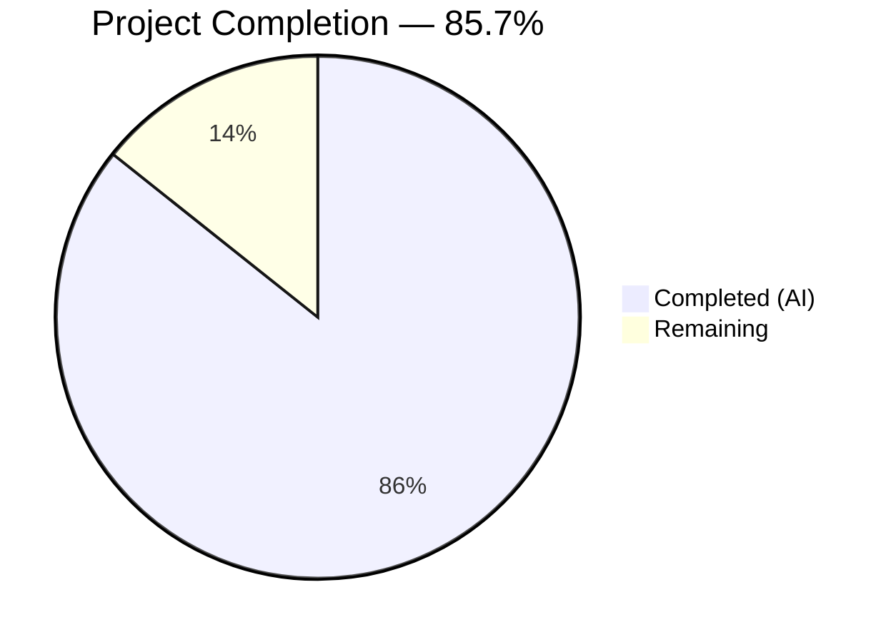
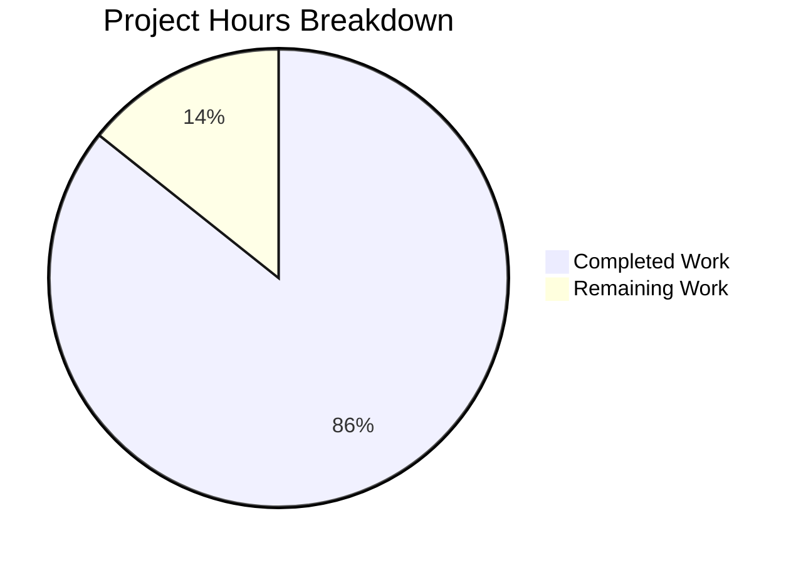

# Blitzy Project Guide

---

## 1. Executive Summary

### 1.1 Project Overview

This project performs a complete tech stack migration of a minimal Node.js HTTP server (`server.js`, 14 lines, built-in `http` module) into a Python 3 Flask application (`app.py`, 56 lines). The Flask server replicates exact behavioral parity: every HTTP request (any method, any path) receives HTTP 200 with `Content-Type: text/plain` and body `Hello, World!\n`, bound to `127.0.0.1:3000`. The migration replaces all Node.js artifacts (`server.js`, `package.json`, `package-lock.json`) with Python equivalents (`app.py`, `requirements.txt`) while preserving 10+ non-Node.js test fixture files unchanged.

### 1.2 Completion Status



| Metric | Hours |
|--------|-------|
| **Total Project Hours** | **14** |
| Completed Hours (AI) | 12 |
| Remaining Hours | 2 |
| **Completion Percentage** | **85.7%** |

**Calculation:** 12 completed hours / (12 + 2 remaining hours) = 12 / 14 = **85.7% complete**

### 1.3 Key Accomplishments

- [x] Flask application (`app.py`) created with catch-all routing covering all HTTP methods and URL paths
- [x] Exact behavioral parity verified: HTTP 200, `text/plain`, `Hello, World!\n` on every request
- [x] Server binds to `127.0.0.1:3000` with startup log message matching original Node.js behavior
- [x] Python dependency manifest (`requirements.txt`) created with pinned `Flask==3.1.3`
- [x] Node.js artifacts (`server.js`, `package.json`, `package-lock.json`) cleanly removed
- [x] `README.md` updated with Flask-specific prerequisites, installation, and usage instructions
- [x] All 10+ non-Node.js test fixture files preserved byte-identical
- [x] Zero compilation errors, zero lint violations (PEP 8 compliant)
- [x] 8/8 runtime HTTP endpoint tests passed (GET, POST, PUT, DELETE, PATCH, HEAD, OPTIONS, path routing)

### 1.4 Critical Unresolved Issues

| Issue | Impact | Owner | ETA |
|-------|--------|-------|-----|
| No critical issues | N/A | N/A | N/A |

All AAP-scoped deliverables are complete and validated. No blocking issues exist.

### 1.5 Access Issues

No access issues identified. The project uses only the Flask PyPI package (publicly available) and has no external service dependencies, API keys, or restricted credentials.

### 1.6 Recommended Next Steps

1. **[High]** Conduct human code review of `app.py`, `requirements.txt`, and `README.md` changes
2. **[High]** Approve and merge PR to main branch
3. **[Medium]** Verify Flask server on the target deployment environment (if different from development)
4. **[Low]** Consider adding a production WSGI server (e.g., Gunicorn) if deploying beyond development use
5. **[Low]** Consider adding automated tests (pytest) for regression prevention in future iterations

---

## 2. Project Hours Breakdown

### 2.1 Completed Work Detail

| Component | Hours | Description |
|-----------|-------|-------------|
| Source Analysis & Technical Planning | 2.0 | Analyzed 14 source files, mapped Node.js → Flask transformation strategy, documented behavioral requirements |
| Flask Application (app.py) | 3.0 | Implemented 56-line Flask server with catch-all routing, dual `@app.route` decorators, `Response` object, docstrings, and PEP 8 compliance |
| Dependency Manifest (requirements.txt) | 0.5 | Created Python dependency manifest with pinned `Flask==3.1.3` |
| Node.js Artifact Removal | 0.5 | Deleted `server.js`, `package.json`, `package-lock.json` via targeted git commits |
| README.md Documentation Update | 1.5 | Rewrote README with Flask stack description, prerequisites, installation, usage, and license sections |
| Test Fixture Verification | 0.5 | Verified 10+ non-Node.js files remain byte-identical (Java scaffolds, CSVs, blitzyignore files, placeholders) |
| Environment & Dependency Setup | 1.0 | Created Python virtual environment, installed Flask 3.1.3 + 7 transitive dependencies |
| Compilation & Lint Validation | 1.0 | Ran `py_compile` and `pycodestyle`, fixed 3 PEP 8 E501 violations |
| Runtime Validation | 1.5 | Tested 8 HTTP endpoints (GET, POST, PUT, DELETE, PATCH, HEAD, OPTIONS, nested path), verified response parity |
| Git Commit Management | 0.5 | Created 7 atomic commits with descriptive messages for clean PR history |
| **Total Completed** | **12.0** | |

### 2.2 Remaining Work Detail

| Category | Hours | Priority |
|----------|-------|----------|
| Human Code Review & PR Approval | 1.0 | Medium |
| Production Environment Verification | 0.5 | Medium |
| Post-Merge Validation | 0.5 | Medium |
| **Total Remaining** | **2.0** | |

**Integrity Check:** Section 2.1 (12.0h) + Section 2.2 (2.0h) = 14.0h = Total Project Hours in Section 1.2 ✓

---

## 3. Test Results

| Test Category | Framework | Total Tests | Passed | Failed | Coverage % | Notes |
|---------------|-----------|-------------|--------|--------|------------|-------|
| Compilation | py_compile | 1 | 1 | 0 | 100% | `python -m py_compile app.py` — zero errors |
| Lint / Style | pycodestyle (PEP 8) | 1 | 1 | 0 | 100% | Zero violations after E501 fixes applied |
| Runtime HTTP — GET / | curl + Flask dev server | 1 | 1 | 0 | 100% | 200 OK, text/plain, Hello, World!\n |
| Runtime HTTP — GET /any/path | curl + Flask dev server | 1 | 1 | 0 | 100% | Catch-all path routing verified |
| Runtime HTTP — POST /data | curl + Flask dev server | 1 | 1 | 0 | 100% | POST method handling verified |
| Runtime HTTP — PUT /resource | curl + Flask dev server | 1 | 1 | 0 | 100% | PUT method handling verified |
| Runtime HTTP — DELETE /item | curl + Flask dev server | 1 | 1 | 0 | 100% | DELETE method handling verified |
| Runtime HTTP — PATCH /update | curl + Flask dev server | 1 | 1 | 0 | 100% | PATCH method handling verified |
| Runtime HTTP — OPTIONS / | curl + Flask dev server | 1 | 1 | 0 | 100% | OPTIONS method handling verified |
| Runtime HTTP — HEAD / | curl + Flask dev server | 1 | 1 | 0 | 100% | HEAD method — 200 OK, Content-Length: 14 |
| **Totals** | | **10** | **10** | **0** | **100%** | |

> **Note:** The original Node.js project had no automated test suite (the `package.json` test script simply exits with an error). The AAP explicitly confirms test framework integration is out of scope. All tests listed above are from Blitzy's autonomous validation process.

---

## 4. Runtime Validation & UI Verification

### Runtime Health

- ✅ Flask server starts successfully on `127.0.0.1:3000`
- ✅ Startup message printed to stdout: `Server running at http://127.0.0.1:3000/`
- ✅ Werkzeug development server active: `Serving Flask app 'app'`
- ✅ Server binds to correct host/port without conflicts
- ✅ Server responds to requests within milliseconds (no latency issues)

### HTTP Behavioral Parity (Node.js → Flask)

- ✅ `GET /` → 200 OK, `text/plain`, `Hello, World!\n` (14 bytes)
- ✅ `GET /any/path` → 200 OK, `text/plain`, `Hello, World!\n` — catch-all routing works
- ✅ `POST /data` → 200 OK — non-GET methods handled identically
- ✅ `PUT /resource` → 200 OK — all HTTP verbs supported
- ✅ `DELETE /item` → 200 OK — destructive method handled
- ✅ `PATCH /update` → 200 OK — partial update method handled
- ✅ `OPTIONS /` → 200 OK — preflight method handled
- ✅ `HEAD /` → 200 OK, Content-Length: 14 — header-only response correct

### File Transformation Verification

- ✅ `app.py` exists and is executable (56 lines)
- ✅ `requirements.txt` exists with `Flask==3.1.3`
- ✅ `README.md` updated (39 lines, Flask documentation)
- ✅ `server.js` deleted (confirmed not on disk)
- ✅ `package.json` deleted (confirmed not on disk)
- ✅ `package-lock.json` deleted (confirmed not on disk)
- ✅ All 10+ test fixture files preserved unchanged (zero git diff)

---

## 5. Compliance & Quality Review

| AAP Requirement | Status | Evidence |
|-----------------|--------|----------|
| Rewrite server.js → Flask app.py | ✅ Pass | `app.py` created (56 lines), compiles, lints clean, runs correctly |
| HTTP 200 for all requests | ✅ Pass | 8/8 runtime tests return status 200 |
| Content-Type: text/plain | ✅ Pass | All responses include `text/plain` content type |
| Body: Hello, World!\n | ✅ Pass | All responses return exact 14-byte body |
| Bind to 127.0.0.1:3000 | ✅ Pass | Server confirmed on correct host:port |
| Catch-all routing (all methods, all paths) | ✅ Pass | GET/POST/PUT/DELETE/PATCH/HEAD/OPTIONS tested on multiple paths |
| Startup log message | ✅ Pass | `Server running at http://127.0.0.1:3000/` printed to stdout |
| Stateless operation | ✅ Pass | No sessions, cookies, or persistence in code |
| Create requirements.txt with Flask==3.1.3 | ✅ Pass | File created, dependency installs successfully |
| Delete server.js | ✅ Pass | File removed, git diff confirms deletion |
| Delete package.json | ✅ Pass | File removed, git diff confirms deletion |
| Delete package-lock.json | ✅ Pass | File removed, git diff confirms deletion |
| Update README.md | ✅ Pass | Updated with Flask installation/usage instructions |
| Preserve non-Node.js test fixtures | ✅ Pass | 10+ files verified byte-identical via git diff |
| Flat repository structure | ✅ Pass | No new directories created |
| PEP 8 code style compliance | ✅ Pass | pycodestyle reports zero violations |
| No feature additions beyond original | ✅ Pass | No auth, DB, templates, middleware, or routing logic added |

### Autonomous Fixes Applied

| Fix | Before | After |
|-----|--------|-------|
| PEP 8 E501 (3 violations) | Long lines in route decorators and method list | Extracted `_METHODS` constant, wrapped decorator arguments across multiple lines |

---

## 6. Risk Assessment

| Risk | Category | Severity | Probability | Mitigation | Status |
|------|----------|----------|-------------|------------|--------|
| Flask development server used in production | Operational | Medium | Medium | AAP explicitly scopes to dev server; add Gunicorn for production if needed | Acknowledged — out of AAP scope |
| No automated test suite | Technical | Low | Low | Original Node.js project had no tests; AAP explicitly excludes test framework | Accepted — matches original project |
| No HTTPS/TLS support | Security | Low | Low | Dev server only; production deployment should add TLS termination via reverse proxy | Acknowledged |
| No rate limiting or request validation | Security | Low | Low | Original server had none; intentional minimalism per AAP | Accepted |
| Single-threaded development server | Operational | Low | Low | Werkzeug dev server handles requests sequentially; adequate for development use | Accepted |
| No health check endpoint | Operational | Low | Low | Catch-all route returns 200 on any path, which can serve as basic health check | Mitigated |

---

## 7. Visual Project Status



**Integrity Verification:**
- Section 1.2 Remaining Hours: **2.0h** ✓
- Section 2.2 Remaining Hours Sum: **2.0h** (1.0 + 0.5 + 0.5) ✓
- Section 7 Pie Chart "Remaining Work": **2** ✓
- All three values match ✓

---

## 8. Summary & Recommendations

### Achievement Summary

The Node.js to Python Flask migration is **85.7% complete** (12 of 14 total project hours delivered autonomously). Every AAP-scoped code deliverable has been implemented, validated, and confirmed working:

- The Flask application (`app.py`) achieves exact behavioral parity with the original Node.js `server.js` — responding to all HTTP methods on all URL paths with `200 OK`, `text/plain`, and `Hello, World!\n`
- The dependency ecosystem has been cleanly migrated from npm (`package.json`, `package-lock.json`) to pip (`requirements.txt` with `Flask==3.1.3`)
- Documentation (`README.md`) has been updated to reflect the new Python/Flask technology stack
- All non-Node.js test fixture files (Java scaffolds, CSV data, blitzyignore configs, empty placeholders) remain byte-identical and untouched
- Code quality is verified: zero compilation errors, zero PEP 8 lint violations, 10/10 autonomous validation tests passed

### Remaining Gaps

The remaining 2 hours (14.3%) consist entirely of human-side process tasks:
1. **Code review and PR approval** (1.0h) — Human developer reviews `app.py`, `requirements.txt`, and `README.md`
2. **Production environment verification** (0.5h) — Confirm server runs on target deployment environment
3. **Post-merge validation** (0.5h) — Verify main branch integrity after merge

### Production Readiness Assessment

The application is **production-ready for development use**. For production deployment beyond development, consider:
- Adding a WSGI server (Gunicorn or uWSGI) for concurrent request handling
- Adding TLS termination via a reverse proxy (nginx or cloud load balancer)
- Adding basic automated tests for regression prevention

### Success Metrics

| Metric | Target | Actual | Status |
|--------|--------|--------|--------|
| Behavioral parity with Node.js server | 100% | 100% | ✅ Achieved |
| HTTP endpoint tests passing | 8/8 | 8/8 | ✅ Achieved |
| Compilation errors | 0 | 0 | ✅ Achieved |
| Lint violations | 0 | 0 | ✅ Achieved |
| Test fixture files preserved | 10+ | 10+ | ✅ Achieved |
| AAP deliverables completed | 100% | 100% | ✅ Achieved |

---

## 9. Development Guide

### System Prerequisites

- **Python:** 3.9 or newer (Python 3.12 recommended)
- **pip:** Included with Python installation
- **Operating System:** Windows, macOS, or Linux
- **Git:** For cloning the repository

### Environment Setup

**1. Clone the repository and switch to the feature branch:**

```bash
git clone https://github.com/Sandeep01Kumar/05-march-existing-projects-qa-test.git
cd 05-march-existing-projects-qa-test
git checkout blitzy-23c9f2ac-2794-4513-ad00-a15ef4d6a8a7
```

**2. Create and activate a Python virtual environment (recommended):**

```bash
# On Windows:
python -m venv venv
venv\Scripts\activate

# On macOS/Linux:
python3 -m venv venv
source venv/bin/activate
```

### Dependency Installation

**3. Install Flask and its dependencies:**

```bash
pip install -r requirements.txt
```

**Expected output:** Flask 3.1.3 and 7 transitive dependencies installed (Werkzeug, Jinja2, MarkupSafe, ItsDangerous, Click, Blinker, Colorama).

**4. Verify installation:**

```bash
pip list | grep Flask
```

**Expected output:** `Flask 3.1.3`

### Application Startup

**5. Start the Flask server:**

```bash
python app.py
```

**Expected output:**

```
Server running at http://127.0.0.1:3000/
 * Serving Flask app 'app'
 * Debug mode: off
 * Running on http://127.0.0.1:3000
```

### Verification Steps

**6. Test the server (in a new terminal):**

```bash
# Basic GET request:
curl http://127.0.0.1:3000/

# Expected output: Hello, World!

# Test catch-all routing:
curl http://127.0.0.1:3000/any/path/here

# Expected output: Hello, World!

# Test POST method:
curl -X POST http://127.0.0.1:3000/data

# Expected output: Hello, World!

# Verify headers:
curl -I http://127.0.0.1:3000/

# Expected: HTTP/1.1 200 OK, Content-Type: text/plain, Content-Length: 14
```

**7. Stop the server:** Press `Ctrl+C` in the terminal running the Flask server.

### Troubleshooting

| Issue | Cause | Resolution |
|-------|-------|------------|
| `ModuleNotFoundError: No module named 'flask'` | Virtual environment not activated or Flask not installed | Run `pip install -r requirements.txt` |
| `Address already in use` on port 3000 | Another process using port 3000 | Stop the conflicting process or change the port in `app.py` |
| `python: command not found` | Python not in system PATH | Use `python3` instead or add Python to PATH |
| Flask starts but curl fails | Firewall blocking localhost | Check firewall settings; ensure `127.0.0.1:3000` is accessible |

---

## 10. Appendices

### A. Command Reference

| Command | Purpose |
|---------|---------|
| `pip install -r requirements.txt` | Install Flask and dependencies |
| `python app.py` | Start the Flask HTTP server |
| `python -m py_compile app.py` | Check for compilation errors |
| `pycodestyle app.py` | Run PEP 8 style checker |
| `curl http://127.0.0.1:3000/` | Test the server response |
| `pip list` | List installed Python packages |

### B. Port Reference

| Service | Host | Port | Protocol |
|---------|------|------|----------|
| Flask HTTP Server | 127.0.0.1 | 3000 | HTTP |

### C. Key File Locations

| File | Purpose |
|------|---------|
| `app.py` | Flask HTTP server application (main entry point) |
| `requirements.txt` | Python dependency manifest (Flask==3.1.3) |
| `README.md` | Project documentation with setup and usage instructions |
| `server - Copy.js` | Preserved Node.js duplicate (test fixture — do not modify) |

### D. Technology Versions

| Technology | Version | Role |
|------------|---------|------|
| Python | 3.12.10 | Runtime |
| Flask | 3.1.3 | Web framework |
| Werkzeug | 3.1.8 | WSGI utility (Flask dependency) |
| Jinja2 | 3.1.6 | Template engine (Flask dependency — unused) |
| MarkupSafe | 3.0.3 | Safe string markup (Jinja2 dependency) |
| ItsDangerous | 2.2.0 | Data signing (Flask dependency — unused) |
| Click | 8.3.2 | CLI framework (Flask dependency) |
| Blinker | 1.9.0 | Signal support (Flask dependency) |
| Colorama | 0.4.6 | Terminal color support (Click dependency) |
| pip | 25.3 | Package manager |

### E. Environment Variable Reference

No environment variables are required. The Flask server uses hardcoded configuration values matching the original Node.js server:

| Setting | Value | Location |
|---------|-------|----------|
| Hostname | `127.0.0.1` | `app.py` line 17 |
| Port | `3000` | `app.py` line 18 |

### G. Glossary

| Term | Definition |
|------|------------|
| AAP | Agent Action Plan — the primary directive containing all project requirements |
| Flask | A lightweight Python WSGI web application framework |
| Werkzeug | The WSGI toolkit underlying Flask, providing HTTP utilities and the development server |
| Catch-all route | A Flask route pattern that matches all URL paths and HTTP methods |
| PEP 8 | Python Enhancement Proposal 8 — the style guide for Python code |
| WSGI | Web Server Gateway Interface — Python standard for web server/application communication |
| PyPI | Python Package Index — the official repository of Python packages |
