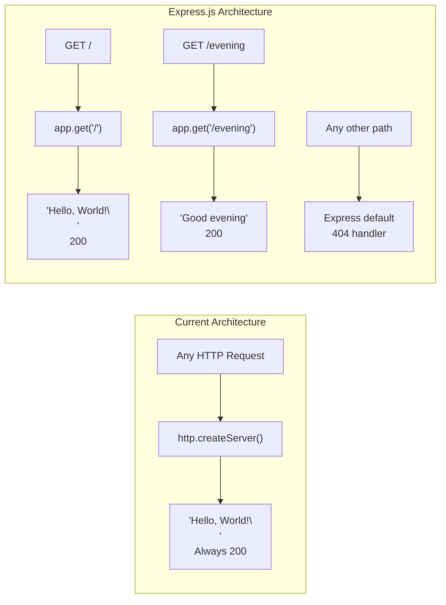

# Technical Specification

# 0. Agent Action Plan

## 0.1 Intent Clarification

### 0.1.1 Core Feature Objective

Based on the prompt, the Blitzy platform understands that the new feature requirement is to:

- **Integrate Express.js into an existing Node.js project**: The repository currently contains a minimal HTTP server (`server.js`) built exclusively with Node.js's built-in `http` module. The user requests replacing or augmenting this with the Express.js web framework to gain routing capabilities, middleware support, and a more structured request-handling model.

- **Preserve the existing "Hello World" endpoint**: The current `server.js` binds to `127.0.0.1:3000` and responds to every incoming request with `"Hello, World!\n"` (status 200, Content-Type `text/plain`). This behavior must be preserved as a dedicated route under the Express.js application.

- **Add a new "Good evening" endpoint**: A second HTTP endpoint must be created that returns the plain-text response `"Good evening"` when accessed at its designated route path.

**Implicit requirements detected:**

- The project's `package.json` must be updated to declare `express` as a runtime dependency, transitioning the project from zero external dependencies to a single framework dependency.
- The `package-lock.json` will need regeneration to reflect the new dependency tree introduced by Express.js and its transitive dependencies.
- The `server - Copy.js` file (an exact duplicate of `server.js`) exists in the repository; its relationship to the modified `server.js` must be considered.
- The `package.json` currently lists `"main": "index.js"` — a reference to a non-existent file — which should be corrected to point to `server.js`, the actual entry point.

### 0.1.2 Special Instructions and Constraints

- **Maintain backward compatibility**: The existing "Hello, World!" response must remain accessible. Migrating to Express.js should not remove or alter this response — it should be served from a defined route (e.g., `GET /`).
- **Follow repository conventions**: The project uses CommonJS module syntax (`require()`). All new code must use CommonJS imports to remain consistent with the existing `server.js` codebase.
- **Minimal footprint principle**: The repository is a tutorial-level project. The implementation should remain simple, clean, and approachable — no unnecessary abstractions, middleware chains, or complex configurations.
- **Single server file**: Given the tutorial nature, both endpoints should reside within `server.js` rather than being split into separate route modules.

User Example (provided verbatim):
> *"this is a tutorial of node js server hosting one endpoint that returns the response "Hello world". Could you add expressjs into the project and add another endpoint that return the response of "Good evening"?"*

### 0.1.3 Technical Interpretation

These feature requirements translate to the following technical implementation strategy:

- To **integrate Express.js**, we will modify `server.js` to replace the `http.createServer()` pattern with an Express application instance (`const app = express()`), retaining the same host (`127.0.0.1`) and port (`3000`) configuration.
- To **preserve the "Hello World" endpoint**, we will create an Express route `app.get('/', ...)` that sends the response `"Hello, World!\n"` with status 200 and Content-Type `text/plain`, matching the current behavior exactly.
- To **add the "Good evening" endpoint**, we will create a new Express route `app.get('/evening', ...)` that sends the response `"Good evening"` with status 200 and Content-Type `text/plain`.
- To **update dependencies**, we will add `express` version `^5.2.1` (the latest stable release, compatible with Node.js ≥ 18) to the `dependencies` block in `package.json` and regenerate `package-lock.json`.
- To **correct the entry point**, we will update the `"main"` field in `package.json` from `"index.js"` to `"server.js"` to accurately reflect the project's actual entry point.

## 0.2 Repository Scope Discovery

### 0.2.1 Comprehensive File Analysis

The repository follows a completely flat directory structure with all 20 files at root level and zero subfolders. The following analysis categorizes every file by its relevance to the Express.js integration feature.

**Existing files requiring modification:**

| File | Type | Modification Reason |
|---|---|---|
| `server.js` | Source (JavaScript/CommonJS) | Core target — refactor from `http.createServer()` to Express.js application with two route handlers (`GET /` and `GET /evening`) |
| `package.json` | Configuration (JSON) | Add `express` to `dependencies`, update `"main"` field from `"index.js"` to `"server.js"`, and add a `"start"` script |
| `package-lock.json` | Lock file (JSON) | Must be regenerated via `npm install` to capture the Express.js dependency tree (Express 5.2.1 brings ~28 transitive dependencies) |
| `README.md` | Documentation (Markdown) | Update to document the new Express.js-based endpoints and usage instructions |

**Existing files evaluated but NOT requiring modification:**

| File | Type | Reason for Exclusion |
|---|---|---|
| `server - Copy.js` | Source duplicate | Exact byte-for-byte copy of `server.js`; serves as a test fixture for duplicate detection (Feature F-005). Not a functional component — no modification needed. |
| `LoginTest.java` | Java stub | Intentionally non-compilable test fixture; unrelated to Node.js/Express.js feature |
| `LoginTest - Copy.java` | Java stub duplicate | Same as above |
| `industry.csv` | Static data | Taxonomy data asset unrelated to HTTP server functionality |
| `industry - Copy.csv` | Static data duplicate | Same as above |
| `.blitzyignore.txt` | Ignore placeholder | Zero-byte sentinel file; no patterns defined |
| `test.blitzyignore.txt` | Ignore placeholder | Zero-byte sentinel file |
| `test1.blitzyignore.txt` | Ignore placeholder | Zero-byte sentinel file |
| `test.py.txt` | Placeholder | Zero-byte file, unrelated |
| `test.py - Copy.txt` | Placeholder duplicate | Zero-byte file, unrelated |

**Integration point discovery:**

- **API endpoints**: The current `server.js` has no routing — it responds identically to all requests. Express.js introduces proper route matching, requiring two explicit route definitions (`GET /` and `GET /evening`).
- **Server binding**: The existing server binds to `127.0.0.1:3000`. The Express.js migration retains this exact configuration via `app.listen(3000, '127.0.0.1', ...)`.
- **Module system**: The project uses CommonJS (`require()`). The Express.js import will follow this convention: `const express = require('express')`.

### 0.2.2 Web Search Research Conducted

- **Express.js latest stable version**: Confirmed via npm registry that Express.js 5.2.1 is the current `latest` tagged release, requiring Node.js ≥ 18. The project's Node.js v20.20.1 runtime is fully compatible.
- **Express.js 5.x migration considerations**: Express 5 dropped support for Node.js < 18, removed deprecated APIs from v3/v4, updated path-to-regexp for security (ReDoS mitigation), and added native async/await middleware support. Since this is a greenfield Express adoption (not a migration from v4), these breaking changes do not apply.
- **Best practices for Express.js route definition**: Standard pattern for simple GET endpoints uses `app.get('/path', (req, res) => { res.send('response') })`.

### 0.2.3 New File Requirements

No new source files need to be created for this feature. The tutorial-level simplicity of the project means both routes are defined directly within the existing `server.js` file.

**New files generated automatically:**

| File/Directory | Purpose |
|---|---|
| `node_modules/` | Created by `npm install` — contains Express.js and its ~28 transitive dependencies |

**No new files required for:**
- Separate route modules (not needed for two simple endpoints)
- Middleware files (no custom middleware required)
- Configuration files (Express.js configuration is inline in `server.js`)
- Test files (the existing test script pattern `"test": "echo \"Error: no test specified\" && exit 1"` is a deliberate fixture behavior per Feature F-003)
- Migration files (no database involved)

## 0.3 Dependency Inventory

### 0.3.1 Private and Public Packages

The following table documents all packages relevant to this feature addition. The project currently has zero dependencies; Express.js will be the first and only external dependency added.

| Registry | Package Name | Version | Purpose |
|---|---|---|---|
| npm (public) | `express` | `^5.2.1` | Web framework providing HTTP routing, middleware pipeline, and request/response utilities for the Node.js server |

**Version justification:**
- Express.js `5.2.1` is the current `latest` tag on npm as verified via `npm view express version`.
- Express 5.x requires Node.js ≥ 18; the project runs Node.js v20.20.1, which satisfies this constraint.
- The caret (`^5.2.1`) version range allows compatible patch and minor updates within the 5.x major version.

**Key transitive dependencies introduced by Express 5.2.1:**

| Package | Version | Role |
|---|---|---|
| `body-parser` | `^2.2.1` | Request body parsing (JSON, URL-encoded) |
| `router` | `^2.2.0` | Express routing engine |
| `cookie` | `^0.7.1` | Cookie parsing utilities |
| `qs` | `^6.14.0` | Query string parsing |
| `send` | `^1.1.0` | Static file streaming |
| `serve-static` | `^2.2.0` | Static file serving middleware |
| `debug` | `^4.4.0` | Debug logging |
| `accepts` | `^2.0.0` | Content negotiation |
| `finalhandler` | `^2.1.0` | Final request handler |

### 0.3.2 Dependency Updates

**Import updates required:**

| File | Current Import | New Import | Change Description |
|---|---|---|---|
| `server.js` | `const http = require('http')` | `const express = require('express')` | Replace Node.js built-in `http` module with Express.js framework |

**Configuration file updates:**

| File | Update Required |
|---|---|
| `package.json` | Add `"dependencies": { "express": "^5.2.1" }` block; update `"main"` from `"index.js"` to `"server.js"`; add `"start": "node server.js"` to `"scripts"` |
| `package-lock.json` | Full regeneration via `npm install` to capture the Express.js dependency tree with lockfileVersion 3 format |

**No import transformation rules needed** — this is a new dependency addition, not a refactoring of existing imports. The single `require('http')` statement is replaced entirely by `require('express')`.

## 0.4 Integration Analysis

### 0.4.1 Existing Code Touchpoints

**Direct modifications required:**

- **`server.js` (lines 1–14)**: The entire file body is replaced. The current implementation uses `http.createServer()` with a single callback that handles all requests identically. This is replaced by an Express application with explicit route definitions.
  - Line 1: Replace `const http = require('http')` with `const express = require('express')` and `const app = express()`
  - Lines 3–4: Retain `hostname` and `port` constants (`127.0.0.1` and `3000`)
  - Lines 6–10: Replace the monolithic `createServer` callback with two discrete Express route handlers:
    - `app.get('/', ...)` — serves `"Hello, World!\n"`
    - `app.get('/evening', ...)` — serves `"Good evening"`
  - Lines 12–14: Replace `server.listen(port, hostname, ...)` with `app.listen(port, hostname, ...)`

- **`package.json` (3 targeted edits)**:
  - Add `"dependencies"` key with `"express": "^5.2.1"`
  - Update `"main"` from `"index.js"` to `"server.js"`
  - Add `"start": "node server.js"` to the `"scripts"` block

- **`package-lock.json` (full regeneration)**: The current lock file contains only the root package entry. After `npm install`, it will expand to include Express.js and all ~28 transitive dependencies with exact resolved versions and integrity hashes.

- **`README.md` (content addition)**: Add documentation describing the Express.js server, available endpoints, and instructions for running the application (`npm start`).

### 0.4.2 Dependency Injection Points

This project has no dependency injection framework, service container, or IoC pattern — it is a single-file tutorial server. The Express application instance (`app`) is created, configured, and started within `server.js` as a self-contained module.

### 0.4.3 Request Flow Transformation

The integration fundamentally changes how HTTP requests are processed:



**Key behavioral change**: Under the current `http` module implementation, all request paths return "Hello, World!". After Express.js integration, only `GET /` returns "Hello, World!", `GET /evening` returns "Good evening", and all other paths receive Express's default 404 response. This is an intentional and expected narrowing of the response surface through proper routing.

## 0.5 Technical Implementation

### 0.5.1 File-by-File Execution Plan

Every file listed below MUST be created or modified as part of this feature addition.

**Group 1 — Core Feature File:**

- **MODIFY: `server.js`** — Replace the `http.createServer()` server with an Express.js application. Define two route handlers: `GET /` returning `"Hello, World!\n"` and `GET /evening` returning `"Good evening"`. Retain the existing `127.0.0.1:3000` bind address and port. Preserve the startup log message.

**Group 2 — Dependency and Configuration:**

- **MODIFY: `package.json`** — Add `"dependencies": { "express": "^5.2.1" }`, update `"main"` from `"index.js"` to `"server.js"`, and add `"start": "node server.js"` to the `"scripts"` block.
- **REGENERATE: `package-lock.json`** — Produced automatically by `npm install`. Will transition from an empty dependency tree to a fully resolved tree containing Express.js 5.2.1 and its transitive dependencies under lockfileVersion 3.

**Group 3 — Documentation:**

- **MODIFY: `README.md`** — Update documentation to describe the Express.js server, list available endpoints with their response values, and provide run instructions (`npm install` followed by `npm start`).

### 0.5.2 Implementation Approach per File

**`server.js` — Express.js migration:**

The implementation establishes the Express.js application as the foundation, registers two GET route handlers, and starts the server. The resulting file remains under 20 lines, preserving the tutorial's simplicity:

```js
const express = require('express');
const app = express();
```

- Route `GET /` sends `"Hello, World!\n"` as plain text (exact match to current behavior)
- Route `GET /evening` sends `"Good evening"` as plain text (new endpoint)
- `app.listen(3000, '127.0.0.1', callback)` retains the original host and port

**`package.json` — Dependency declaration:**

```json
"dependencies": { "express": "^5.2.1" }
```

- The `"main"` field is corrected from `"index.js"` to `"server.js"`
- A `"start"` script is added for standard npm invocation

**`package-lock.json` — Automatic regeneration:**

Produced by running `npm install` in the project directory. No manual editing required.

**`README.md` — Documentation update:**

Update the README to describe the project as an Express.js server with two endpoints, replacing the current placeholder text with usage instructions and endpoint documentation.

### 0.5.3 User Interface Design

Not applicable — this feature adds HTTP API endpoints returning plain-text responses. There is no user interface, frontend component, or visual design involved.

## 0.6 Scope Boundaries

### 0.6.1 Exhaustively In Scope

**Source files:**
- `server.js` — Full rewrite from `http` module to Express.js with two route handlers

**Configuration files:**
- `package.json` — Add Express.js dependency, fix `"main"` field, add `"start"` script
- `package-lock.json` — Full regeneration via `npm install`

**Documentation:**
- `README.md` — Update with Express.js server description, endpoint listing, and usage instructions

**Generated artifacts:**
- `node_modules/` — Created by `npm install`, containing Express.js and all transitive dependencies

### 0.6.2 Explicitly Out of Scope

- **`server - Copy.js`** — This file is a deliberate duplicate of `server.js` serving as a test fixture for duplicate-file detection (Feature F-005). It is not a functional component and must not be modified to preserve its testing purpose.
- **Java files** (`LoginTest.java`, `LoginTest - Copy.java`) — Intentionally non-compilable test fixtures unrelated to the Node.js server feature.
- **CSV files** (`industry.csv`, `industry - Copy.csv`) — Static taxonomy data assets with no connection to HTTP endpoint functionality.
- **Zero-byte sentinel files** (`.blitzyignore.txt`, `test.blitzyignore.txt`, `test1.blitzyignore.txt`, `test.py.txt`, `test.py - Copy.txt`) — Empty placeholder files for edge-case testing.
- **Binary assets** (`100Pages.pdf`, `100Pages - Copy.pdf`, `demo.jpg`, `demo - Copy.jpg`, `sample.doc`, `sample - Copy.doc`) — Static binary files unrelated to server functionality.
- **Additional middleware or route modules** — The tutorial's simplicity means all routes remain in `server.js`; no separate `routes/` directory or middleware files are needed.
- **Test infrastructure** — The project's deliberate test-failure script (`"test": "echo \"Error: no test specified\" && exit 1"`) is an intentional fixture behavior (Feature F-003) and must not be altered.
- **Performance optimizations** — Compression, caching, rate limiting, or clustering are beyond the tutorial's scope.
- **HTTPS/TLS configuration** — The server continues to use plain HTTP on localhost.
- **Environment-specific configuration** — No `.env` files, environment variable parsing, or multi-environment support is required.

## 0.7 Rules for Feature Addition

### 0.7.1 Feature-Specific Rules and Requirements

- **CommonJS module convention**: All code must use `require()` / `module.exports` syntax consistent with the existing `server.js`. ES module syntax (`import`/`export`) must not be introduced.

- **Preserve server identity**: The server must continue to bind to `127.0.0.1:3000` and produce a startup log message consistent with the original format (`Server running at http://127.0.0.1:3000/`).

- **Exact response fidelity for existing endpoint**: The `GET /` route must return the exact string `"Hello, World!\n"` (including the trailing newline) with Content-Type `text/plain` and status code 200, matching the current `http` module behavior byte-for-byte.

- **New endpoint response format**: The `GET /evening` route must return the string `"Good evening"` with Content-Type `text/plain` and status code 200.

- **Minimal dependency footprint**: Only `express` may be added as a direct dependency. No additional packages (e.g., `cors`, `helmet`, `morgan`) should be introduced unless explicitly requested.

- **Tutorial simplicity**: The resulting `server.js` must remain concise and readable, suitable for a beginner-level Node.js tutorial. No unnecessary abstractions, classes, or architectural patterns should be applied.

- **No modification of test fixtures**: Files that serve as deliberate test fixtures for the backprop system (`server - Copy.js`, Java files, CSV files, zero-byte sentinels, binary assets) must remain completely untouched to preserve integration test integrity.

## 0.8 References

### 0.8.1 Repository Files and Folders Searched

The following files and folders were inspected during the analysis to derive the conclusions in this Agent Action Plan:

| Path | Type | Inspection Purpose |
|---|---|---|
| `/` (root) | Folder | Complete repository structure enumeration — all 20 files identified, zero subfolders confirmed |
| `server.js` | File | Primary target file — analyzed full contents (15 lines) to understand current `http.createServer()` implementation |
| `server - Copy.js` | File | Verified as byte-for-byte duplicate of `server.js`; confirmed role as test fixture (Feature F-005) |
| `package.json` | File | Analyzed dependency state (zero dependencies), `"main"` field (`"index.js"`), scripts, and project metadata |
| `package-lock.json` | File | Confirmed lockfileVersion 3 with empty packages map — zero resolved third-party packages |
| `README.md` | File | Reviewed project description and "Do not touch!" directive |
| `.blitzyignore.txt` | File | Confirmed zero-byte / empty — no ignore patterns defined |
| `test.blitzyignore.txt` | File | Confirmed zero-byte / empty |
| `test1.blitzyignore.txt` | File | Confirmed zero-byte / empty |

### 0.8.2 Technical Specification Sections Referenced

| Section | Purpose |
|---|---|
| 1.1 Executive Summary | Understood repository purpose as a backprop integration test fixture |
| 2.1 Feature Catalog | Reviewed all 10 features (F-001 through F-010) to identify which test fixtures must remain untouched |
| 3.1 Technology Stack Overview | Confirmed Node.js ≥ 15 runtime, zero-framework architecture, and technology constraints |
| 3.3 Frameworks & Libraries | Verified the intentional zero-framework/zero-library state and its rationale |
| 5.1 High-Level Architecture | Analyzed system boundaries, component groups, and the read-only fixture consumption model |

### 0.8.3 External Research Conducted

| Source | Information Retrieved |
|---|---|
| npm registry (`npmjs.com/package/express`) | Confirmed Express.js latest version: 5.2.1, Node.js engine requirement: ≥ 18 |
| Express.js GitHub releases (`github.com/expressjs/express/releases`) | Confirmed Express 5 stable release with dropped Node.js < 18 support and async middleware improvements |
| Express.js official blog (`expressjs.com/2025/03/31/v5-1-latest-release.html`) | Confirmed Express 5.1.0 as the npm `latest` tag with LTS timeline |

### 0.8.4 Attachments

No attachments were provided for this project. No Figma URLs or external design assets are associated with this feature request.

