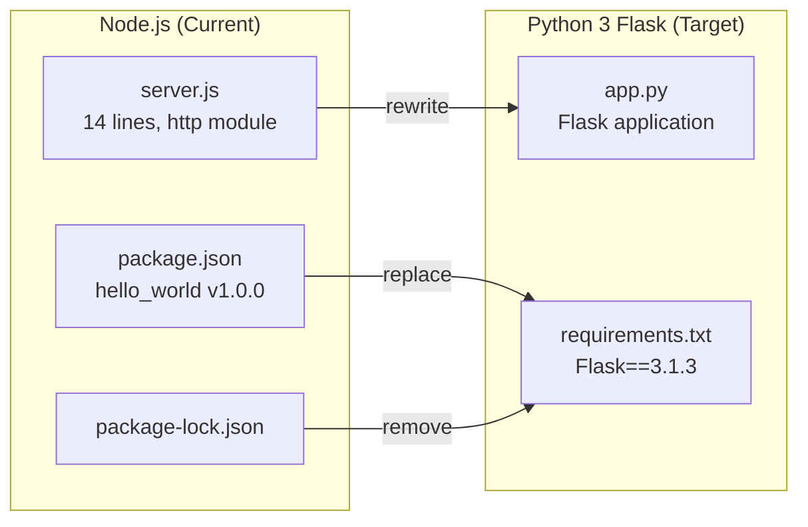

# Technical Specification

# 0. Agent Action Plan

## 0.1 Intent Clarification


### 0.1.1 Core Refactoring Objective

Based on the prompt, the Blitzy platform understands that the refactoring objective is to perform a **complete tech stack migration** of an existing Node.js HTTP server into a Python 3 Flask application. The user's directive is explicit: *"Rewrite this Node.js server into a Python 3 Flask application, keeping every feature and functionality exactly as in the original Node.js project. Ensure the rewritten version fully matches the behavior and logic of the current implementation."*

- **Refactoring type:** Tech stack migration (Node.js → Python 3 Flask)
- **Target repository:** Same repository — the existing Node.js codebase will be replaced in-place with its Python Flask equivalent
- **Behavioral parity mandate:** The rewritten Flask application must produce identical observable behavior to the original `server.js`, meaning:
  - Respond to every HTTP request (any method, any path) with HTTP 200
  - Return `Content-Type: text/plain` header
  - Return the body `Hello, World!\n`
  - Bind to `127.0.0.1` on port `3000`
  - Log a startup confirmation message to stdout upon successful binding
- **Implicit requirements surfaced by analysis:**
  - The Flask server must remain **stateless** — no sessions, cookies, or persistence, matching the original
  - No request routing logic — the catch-all behavior must be preserved (all methods, all paths receive the same response)
  - No middleware, no input validation, and no error handling beyond framework defaults — matching the original's intentional minimalism
  - The NPM package ecosystem (`package.json`, `package-lock.json`) must be replaced with a Python dependency manifest (`requirements.txt`)
  - The `README.md` must be updated to reflect the new Python/Flask technology stack
  - Non-Node.js artifacts that are unrelated to the server logic (Java scaffolds, CSV data, empty placeholders, blitzyignore files, and duplicate "Copy" files) must be preserved unchanged, as they serve as Blitzy platform test fixtures

### 0.1.2 Technical Interpretation

This refactoring translates to the following technical transformation strategy:

- **Current architecture:** A 14-line Node.js script (`server.js`) using the built-in `http` module with CommonJS `require()` syntax, binding to `127.0.0.1:3000`, returning a fixed plain-text response to every request
- **Target architecture:** A Python 3 Flask application (`app.py`) using the Flask micro-framework's routing and response system, binding to `127.0.0.1:3000`, returning an identical fixed plain-text response to every request
- **Transformation rules:**
  - `require('http')` → `from flask import Flask`
  - `http.createServer((req, res) => {...})` → `@app.route('/', defaults={'path': ''})` with a catch-all route and `methods` parameter covering all HTTP verbs
  - `res.statusCode = 200` → Flask default return status 200
  - `res.setHeader('Content-Type', 'text/plain')` → `Response('Hello, World!\n', content_type='text/plain')`
  - `res.end('Hello, World!\n')` → Flask `Response` object or `make_response` with the identical body string
  - `server.listen(port, hostname, callback)` → `app.run(host='127.0.0.1', port=3000)`
  - `console.log(...)` → Python `print()` for startup message (Flask outputs its own startup banner)
  - `package.json` + `package-lock.json` → `requirements.txt`




## 0.2 Source Analysis


### 0.2.1 Comprehensive Source File Discovery

The repository is a completely flat structure with **14 files at root level** and **zero subdirectories**. Every file has been inspected using `read_file` and `get_source_folder_contents`. The following categorization identifies all files relevant to the refactoring:

**Node.js Server Files (Primary refactoring targets):**

| File | Lines | Purpose | Refactoring Action |
|------|-------|---------|-------------------|
| `server.js` | 14 | Main HTTP server using Node.js built-in `http` module; binds to `127.0.0.1:3000`, returns `Hello, World!\n` with HTTP 200 and `text/plain` content type for every request | Rewrite as Flask `app.py` |
| `server - Copy.js` | 14 | Byte-identical duplicate of `server.js` (test fixture for duplicate detection) | Preserve unchanged |
| `package.json` | 11 | NPM manifest declaring `hello_world` v1.0.0, author `hxu`, MIT license, `main: "index.js"` (intentionally missing), zero dependencies | Replace with `requirements.txt` |
| `package-lock.json` | 13 | NPM lockfile (lockfileVersion 3) confirming zero external packages | Remove (superseded by `requirements.txt`) |

**Non-Node.js Artifacts (Preserved unchanged — test fixtures):**

| File | Type | Purpose | Action |
|------|------|---------|--------|
| `LoginTest.java` | Java scaffold | Non-compilable class with stray `Web` token in `com.blitzyTest` package | Preserve unchanged |
| `LoginTest - Copy.java` | Java scaffold | Byte-identical duplicate of `LoginTest.java` | Preserve unchanged |
| `industry.csv` | CSV data | 43-entry single-column industry taxonomy | Preserve unchanged |
| `industry - Copy.csv` | CSV data | Byte-identical duplicate of `industry.csv` | Preserve unchanged |
| `README.md` | Documentation | Project identity — "hao-backprop-test", warns "Do not touch!" | Update to reflect Flask stack |
| `.blitzyignore.txt` | Config | Empty Blitzy ignore-rule file | Preserve unchanged |
| `test.blitzyignore.txt` | Config | Empty Blitzy ignore-rule file | Preserve unchanged |
| `test1.blitzyignore.txt` | Config | Empty Blitzy ignore-rule file | Preserve unchanged |
| `test.py.txt` | Placeholder | Empty file with Python-suggestive name | Preserve unchanged |
| `test.py - Copy.txt` | Placeholder | Empty duplicate of `test.py.txt` | Preserve unchanged |

### 0.2.2 Current Structure Mapping

```
Current (Root — flat, 14 files, 0 subdirectories):
├── server.js                 (14 lines — PRIMARY: Node.js HTTP server → rewrite to Flask)
├── server - Copy.js          (14 lines — duplicate of server.js → preserve)
├── package.json              (11 lines — NPM manifest → replace with requirements.txt)
├── package-lock.json         (13 lines — NPM lockfile → remove)
├── README.md                 (2 lines — project docs → update)
├── LoginTest.java            (12 lines — Java scaffold → preserve)
├── LoginTest - Copy.java     (12 lines — duplicate → preserve)
├── industry.csv              (45 lines — reference data → preserve)
├── industry - Copy.csv       (45 lines — duplicate → preserve)
├── .blitzyignore.txt         (0 bytes — empty → preserve)
├── test.blitzyignore.txt     (0 bytes — empty → preserve)
├── test1.blitzyignore.txt    (0 bytes — empty → preserve)
├── test.py.txt               (0 bytes — empty → preserve)
└── test.py - Copy.txt        (0 bytes — empty → preserve)
```

### 0.2.3 Source Server Behavior Analysis

The `server.js` implementation exhibits the following behavior that must be exactly replicated:

- **Module loading:** `const http = require('http')` — loads Node.js built-in HTTP module via CommonJS
- **Configuration constants:** `hostname = '127.0.0.1'`, `port = 3000` — hardcoded, not configurable
- **Server creation:** `http.createServer((req, res) => {...})` — single callback, no routing
- **Response pipeline (every request, regardless of method or path):**
  - Sets status code to `200`
  - Sets `Content-Type` header to `text/plain`
  - Sends body `Hello, World!\n` and ends the response
- **Server binding:** `server.listen(port, hostname, callback)` — binds to loopback on port 3000
- **Startup log:** `console.log(\`Server running at http://${hostname}:${port}/\`)` — prints confirmation to stdout
- **No error handling:** No `try/catch`, no `server.on('error')`, no `process.on('uncaughtException')`
- **Stateless:** No sessions, cookies, databases, or file writes


## 0.3 Scope Boundaries


### 0.3.1 Exhaustively In Scope

**Source transformations (Node.js → Python Flask):**
- `server.js` — Full rewrite to `app.py` as a Python 3 Flask application replicating identical HTTP behavior
- `package.json` — Replace with `requirements.txt` containing pinned Flask dependency
- `package-lock.json` — Remove entirely (superseded by `requirements.txt`)

**Documentation updates:**
- `README.md` — Update to reflect the new Python/Flask technology stack, installation instructions, and run commands

**New files to create:**
- `app.py` — The Flask application (replaces `server.js`)
- `requirements.txt` — Python dependency manifest (replaces `package.json` / `package-lock.json`)

**Behavioral requirements that must be preserved identically:**
- HTTP server listens on `127.0.0.1:3000`
- Every request (any HTTP method, any path) receives HTTP 200 with `Content-Type: text/plain` and body `Hello, World!\n`
- Startup message logged to stdout confirming the server URL
- Zero external dependencies beyond Flask and its transitive dependencies
- Fully stateless operation — no persistence, no sessions, no cookies

### 0.3.2 Explicitly Out of Scope

**Files preserved unchanged (Blitzy platform test fixtures):**
- `server - Copy.js` — Byte-identical duplicate of original `server.js`; preserved as-is for duplicate detection testing
- `LoginTest.java` — Non-compilable Java scaffold; not part of the Node.js server
- `LoginTest - Copy.java` — Duplicate Java scaffold; preserved for testing
- `industry.csv` — Static reference data; unrelated to server functionality
- `industry - Copy.csv` — Duplicate CSV; preserved for testing
- `.blitzyignore.txt` — Empty Blitzy config artifact
- `test.blitzyignore.txt` — Empty Blitzy config artifact
- `test1.blitzyignore.txt` — Empty Blitzy config artifact
- `test.py.txt` — Empty placeholder file
- `test.py - Copy.txt` — Empty duplicate placeholder

**Capabilities explicitly not being added:**
- No API routing or endpoint differentiation — the catch-all behavior is intentional
- No authentication, authorization, or session management
- No database integration or ORM
- No template rendering (Jinja2 is a Flask transitive dependency but not used)
- No containerization (no `Dockerfile` or `docker-compose.yml`)
- No CI/CD pipeline definitions
- No test framework integration (no pytest or unittest files)
- No environment variable configuration (`.env` files)
- No WSGI production server setup (e.g., Gunicorn) — development server only, matching original Node.js behavior
- No Express.js or any additional Node.js framework migration — the original uses only the built-in `http` module


## 0.4 Target Design


### 0.4.1 Refactored Structure Planning

The target structure maintains the flat repository layout (zero subdirectories) consistent with the original design, replacing only Node.js-specific artifacts with Python/Flask equivalents while preserving all non-Node.js test fixtures.

```
Target (Root — flat structure preserved):
├── app.py                    (NEW — Flask HTTP server, replaces server.js)
├── requirements.txt          (NEW — Python dependency manifest, replaces package.json)
├── README.md                 (UPDATED — reflects Flask stack)
├── server - Copy.js          (PRESERVED — duplicate test fixture)
├── LoginTest.java            (PRESERVED — Java scaffold test fixture)
├── LoginTest - Copy.java     (PRESERVED — duplicate test fixture)
├── industry.csv              (PRESERVED — reference data test fixture)
├── industry - Copy.csv       (PRESERVED — duplicate test fixture)
├── .blitzyignore.txt         (PRESERVED — empty config artifact)
├── test.blitzyignore.txt     (PRESERVED — empty config artifact)
├── test1.blitzyignore.txt    (PRESERVED — empty config artifact)
├── test.py.txt               (PRESERVED — empty placeholder)
└── test.py - Copy.txt        (PRESERVED — empty placeholder)
```

**Files removed from repository:**
- `server.js` — Replaced by `app.py`
- `package.json` — Replaced by `requirements.txt`
- `package-lock.json` — Replaced by `requirements.txt`

### 0.4.2 Web Search Research Conducted

Research was conducted to inform the target design decisions:

- **Flask latest stable version:** Flask 3.1.3 (released February 19, 2026) confirmed as the current production-stable release on PyPI, fully compatible with Python 3.12
- **Flask minimum Python version:** Flask 3.1.x requires Python 3.9 or newer; Python 3.12 is recommended for best performance
- **Flask transitive dependencies:** Werkzeug ≥ 3.1, ItsDangerous ≥ 2.2, Blinker ≥ 1.9, Jinja2, MarkupSafe, Click — all installed automatically with Flask
- **Flask application structure best practices:** For a minimal single-purpose server, a single `app.py` file is the recommended approach — Flask does not enforce directory structure
- **Node.js to Flask behavioral mapping:** Flask's `@app.route` with catch-all pattern and `methods` parameter replaces Node.js `http.createServer` callback; Flask's `Response` object with `content_type` parameter replaces manual header setting

### 0.4.3 Design Pattern Applications

Given the extreme minimalism of the source application (14 lines, single-purpose), the following design decisions apply:

- **Single-file pattern:** The Flask application will reside in a single `app.py` file, matching the simplicity of the original `server.js`. No application factory pattern, no blueprints, and no package structure are warranted for this scope.
- **Catch-all route pattern:** A single Flask route using `@app.route('/', defaults={'path': ''})` combined with `@app.route('/<path:path>')` will capture all incoming requests on any URL path, replicating Node.js's behavior of handling every request identically.
- **Direct response pattern:** The Flask `Response` class will be used to construct the exact response (status 200, `text/plain`, `Hello, World!\n`), ensuring byte-level compatibility with the original output.
- **Development server binding:** `app.run(host='127.0.0.1', port=3000)` will bind Flask's built-in Werkzeug development server to the same network interface and port as the original Node.js server.


## 0.5 Transformation Mapping


### 0.5.1 File-by-File Transformation Plan

Every target file has been mapped to its corresponding source file. No files are left pending or undiscovered.

| Target File | Transformation | Source File | Key Changes |
|------------|---------------|-------------|-------------|
| `app.py` | CREATE | `server.js` | Rewrite Node.js HTTP server as Python 3 Flask application; replicate identical HTTP behavior (catch-all route, HTTP 200, `text/plain`, `Hello, World!\n` body, bind to `127.0.0.1:3000`, startup log message) |
| `requirements.txt` | CREATE | `package.json` | Replace NPM manifest with Python dependency manifest; pin `Flask==3.1.3` as the sole explicit dependency |
| `README.md` | UPDATE | `README.md` | Update project description to reflect Python/Flask stack; add Flask-specific installation and run instructions; preserve project identity |
| `server.js` | DELETE | `server.js` | Remove original Node.js server file — functionality fully replaced by `app.py` |
| `package.json` | DELETE | `package.json` | Remove NPM manifest — replaced by `requirements.txt` |
| `package-lock.json` | DELETE | `package-lock.json` | Remove NPM lockfile — no longer needed after migration to Python |
| `server - Copy.js` | REFERENCE | `server - Copy.js` | Preserve unchanged — Blitzy duplicate detection test fixture |
| `LoginTest.java` | REFERENCE | `LoginTest.java` | Preserve unchanged — Java scaffold test fixture |
| `LoginTest - Copy.java` | REFERENCE | `LoginTest - Copy.java` | Preserve unchanged — duplicate Java test fixture |
| `industry.csv` | REFERENCE | `industry.csv` | Preserve unchanged — static reference data |
| `industry - Copy.csv` | REFERENCE | `industry - Copy.csv` | Preserve unchanged — duplicate CSV test fixture |
| `.blitzyignore.txt` | REFERENCE | `.blitzyignore.txt` | Preserve unchanged — empty Blitzy config artifact |
| `test.blitzyignore.txt` | REFERENCE | `test.blitzyignore.txt` | Preserve unchanged — empty Blitzy config artifact |
| `test1.blitzyignore.txt` | REFERENCE | `test1.blitzyignore.txt` | Preserve unchanged — empty Blitzy config artifact |
| `test.py.txt` | REFERENCE | `test.py.txt` | Preserve unchanged — empty placeholder |
| `test.py - Copy.txt` | REFERENCE | `test.py - Copy.txt` | Preserve unchanged — empty placeholder |

### 0.5.2 Cross-File Dependencies

**Import statement transformations:**

The original Node.js codebase has a single import. The Flask replacement follows:

- **FROM (Node.js CommonJS):** `const http = require('http');`
- **TO (Python Flask):** `from flask import Flask, Response`

**Configuration transformations:**

- **FROM (Node.js):** Hardcoded constants `const hostname = '127.0.0.1'; const port = 3000;`
- **TO (Python):** Parameters passed to `app.run(host='127.0.0.1', port=3000)`

**Dependency manifest transformations:**

- **FROM (NPM):** `package.json` with zero `dependencies` → `package-lock.json` with zero locked packages
- **TO (pip):** `requirements.txt` containing `Flask==3.1.3`

**Startup message transformation:**

- **FROM (Node.js):** `` console.log(`Server running at http://${hostname}:${port}/`) ``
- **TO (Python):** `print(f"Server running at http://{hostname}:{port}/")` — Flask also outputs its own built-in startup banner via Werkzeug

### 0.5.3 One-Phase Execution

The entire refactor will be executed by Blitzy in **one single phase**. All file creations, updates, deletions, and preservations are performed simultaneously. There is no multi-phase or staged migration. The transformation is atomic — the repository transitions from a Node.js project to a Python Flask project in a single operation.


## 0.6 Dependency Inventory


### 0.6.1 Key Packages

The following table lists all key packages relevant to this refactoring exercise. The original Node.js project has zero external dependencies. The target Python Flask project introduces Flask as the sole explicit dependency, which brings its own transitive dependencies.

**Source (Node.js) — Dependencies being removed:**

| Package Registry | Package Name | Version | Purpose |
|-----------------|--------------|---------|---------|
| npm | (none) | — | The original `package.json` declares zero `dependencies` and zero `devDependencies`. The `package-lock.json` (lockfileVersion 3) confirms an empty dependency tree with only the root package entry. The sole dependency used is the Node.js built-in `http` module, which is part of the standard library. |

**Target (Python) — Dependencies being added:**

| Package Registry | Package Name | Version | Purpose |
|-----------------|--------------|---------|---------|
| PyPI | Flask | 3.1.3 | Lightweight WSGI web application framework — provides routing, request/response handling, and development server |
| PyPI | Werkzeug | 3.1.8 | WSGI utility library — Flask's underlying HTTP server and request/response toolkit (transitive dependency) |
| PyPI | Jinja2 | 3.1.6 | Template engine — Flask transitive dependency (not actively used in this application) |
| PyPI | MarkupSafe | 3.0.3 | Safe string markup — Jinja2 transitive dependency |
| PyPI | ItsDangerous | 2.2.0 | Data signing for session cookies — Flask transitive dependency (not actively used) |
| PyPI | Click | 8.3.2 | CLI framework — provides the `flask` command (transitive dependency) |
| PyPI | Blinker | 1.9.0 | Signal support — Flask transitive dependency |

**Runtime:**

| Runtime | Current Version | Target Version | Purpose |
|---------|----------------|---------------|---------|
| Node.js | 20.20.2 (installed) | Not required after migration | Original server runtime — being replaced |
| Python | 3.12.3 (installed) | 3.12.3 | Target server runtime for Flask application |

### 0.6.2 Dependency Updates

**Import refactoring:**

There is exactly one source file with imports that will be transformed. No wildcard patterns are needed because the project has a single executable file.

| File | Current Import | Target Import |
|------|---------------|---------------|
| `server.js` → `app.py` | `const http = require('http');` | `from flask import Flask, Response` |

**External reference updates:**

| File Category | Current File | Target File | Change Description |
|--------------|-------------|-------------|-------------------|
| Dependency manifest | `package.json` | `requirements.txt` | Replace NPM manifest with pip requirements; content changes from JSON package metadata to a single pinned dependency line `Flask==3.1.3` |
| Lock file | `package-lock.json` | (none — removed) | NPM lockfile is removed; pip's `requirements.txt` with pinned versions serves as the deterministic dependency specification |
| Documentation | `README.md` | `README.md` | Update installation instructions from `npm install` to `pip install -r requirements.txt`; update run command from `node server.js` to `python app.py` |


## 0.7 Refactoring Rules


### 0.7.1 Refactoring-Specific Rules

The following rules are derived from the user's explicit directive to keep "every feature and functionality exactly as in the original Node.js project" and to ensure the rewritten version "fully matches the behavior and logic of the current implementation":

- **Exact behavioral parity:** The Flask application must produce byte-identical HTTP responses to the original Node.js server — same status code (200), same `Content-Type` header (`text/plain`), same response body (`Hello, World!\n` including the trailing newline character)
- **Identical network binding:** The Flask server must bind to `127.0.0.1:3000`, matching the original Node.js server's hostname and port exactly
- **Universal request handling:** Every HTTP request, regardless of method (GET, POST, PUT, DELETE, PATCH, HEAD, OPTIONS) and regardless of URL path, must receive the identical response — no routing differentiation
- **Stateless operation:** No sessions, cookies, caching, or any form of state persistence may be introduced
- **No feature additions:** The migration must not introduce capabilities not present in the original — no authentication, no database, no template rendering, no API differentiation, no middleware
- **Startup logging:** A human-readable startup confirmation message indicating the server URL must be printed to stdout
- **Preserve all non-Node.js test fixtures:** All Java scaffolds, CSV data files, empty placeholders, blitzyignore files, and duplicate "Copy" files must remain byte-identical and untouched

### 0.7.2 Special Instructions and Constraints

- **User-specified implementation rule:** `"Npm create"` — This rule is acknowledged. As the project is migrating away from the npm ecosystem entirely, the equivalent action in the Python context is the creation of `requirements.txt` as the new dependency manifest, and `app.py` as the application entry point. No npm commands will be relevant post-migration.
- **No production server:** The Flask application should use Flask's built-in development server (`app.run()`), matching the original Node.js approach of using the built-in `http.createServer()` without a production-grade server like Gunicorn or uWSGI
- **MIT License preservation:** The original project is licensed under MIT (per `package.json`). This license should be maintained in the updated project context
- **Flat directory structure:** The repository's flat structure (zero subdirectories) must be maintained — no new directories should be created
- **Duplicate file strategy:** The `server - Copy.js` file is intentionally preserved as a historical artifact of the original Node.js implementation and as a continued test fixture for the Blitzy platform's duplicate detection capabilities

### 0.7.3 User-Provided Rules

| Rule Name | Rule Content | Interpretation |
|-----------|-------------|----------------|
| QA-Rules-07-Apr | `Npm create` | Acknowledged — the npm dependency ecosystem creation is translated to Python equivalents: `requirements.txt` replaces `package.json` as the dependency manifest, and `app.py` replaces `server.js` as the application entry point |


## 0.8 References


### 0.8.1 Codebase Files and Folders Searched

The following files and folders were comprehensively searched, retrieved, and analyzed to derive the conclusions documented in this Agent Action Plan:

**Repository root (all 14 files — complete coverage):**

| File Path | Type | Retrieved Via | Key Findings |
|-----------|------|---------------|--------------|
| `server.js` | JavaScript | `read_file` | 14-line Node.js HTTP server using built-in `http` module; binds to `127.0.0.1:3000`; returns `Hello, World!\n` with HTTP 200 and `text/plain` |
| `server - Copy.js` | JavaScript | `read_file` | Byte-identical duplicate of `server.js` |
| `package.json` | JSON | `read_file` | NPM manifest: `hello_world` v1.0.0, author `hxu`, MIT license, `main: "index.js"` (missing), zero dependencies |
| `package-lock.json` | JSON | `read_file` | lockfileVersion 3; confirms zero external npm packages |
| `README.md` | Markdown | `read_file` | Project name `hao-backprop-test`; warns "Do not touch!" |
| `LoginTest.java` | Java | `read_file` | Package `com.blitzyTest`; non-compilable scaffold with stray `Web` token |
| `LoginTest - Copy.java` | Java | `read_file` | Byte-identical duplicate of `LoginTest.java` |
| `industry.csv` | CSV | `read_file` | 43-entry single-column industry taxonomy with header row |
| `industry - Copy.csv` | CSV | `read_file` | Byte-identical duplicate of `industry.csv` |
| `.blitzyignore.txt` | Text | `get_source_folder_contents` | Empty file (0 bytes) — no ignore rules defined |
| `test.blitzyignore.txt` | Text | `get_source_folder_contents` | Empty file (0 bytes) — no ignore rules defined |
| `test1.blitzyignore.txt` | Text | `get_source_folder_contents` | Empty file (0 bytes) — no ignore rules defined |
| `test.py.txt` | Text | `get_source_folder_contents` | Empty file (0 bytes) — placeholder |
| `test.py - Copy.txt` | Text | `get_source_folder_contents` | Empty file (0 bytes) — duplicate placeholder |
| (root folder) | Folder | `get_source_folder_contents` | Flat structure, 14 files, 0 subdirectories confirmed |

### 0.8.2 Technical Specification Sections Referenced

| Section | Purpose |
|---------|---------|
| 1.1 Executive Summary | Project overview and purpose as Blitzy integration test fixture |
| 1.3 Scope | In-scope and out-of-scope boundaries; confirmed Node.js server is the sole functional component |
| 2.1 Feature Catalog | Complete feature inventory (F-001 through F-007); confirmed `server.js` behavior |
| 3.1 Stack Overview | Technology stack documentation; confirmed zero external dependencies |
| 3.4 Open Source Dependencies | Verified zero npm dependencies from both `package.json` and `package-lock.json` |
| 4.2 HTTP Server Lifecycle Processes | Detailed server startup, request-response cycle, and state machine documentation |
| 5.2 Component Details | Component-level analysis of `server.js`, NPM config, and multi-language artifacts |
| 6.1 Core Services Architecture | Architecture assessment confirming minimalist single-process design |

### 0.8.3 External Web Sources Referenced

| Source | URL | Key Information |
|--------|-----|-----------------|
| Flask on PyPI | https://pypi.org/project/Flask/ | Confirmed Flask 3.1.3 as latest stable release (Feb 19, 2026); production-stable status |
| Flask GitHub Releases | https://github.com/pallets/flask/releases | Flask 3.1.x version history; dropped Python 3.8 support; requires Werkzeug ≥ 3.1 |
| Flask Installation Docs | https://flask.palletsprojects.com/en/stable/installation/ | Flask supports Python 3.9+; recommended to use latest Python; lists transitive dependencies |
| Flask REST API Tutorial (2026) | https://tech-insider.org/flask-tutorial-rest-api-python-2026/ | Confirmed Flask 3.1.3 tested on Python 3.12 as of April 2026 |

### 0.8.4 Attachments and External Metadata

- **Attachments provided:** None
- **Figma URLs provided:** None
- **Environment files provided:** None (the `/tmp/environments_files` directory is empty)
- **Environment variables:** None specified
- **Secrets:** None specified
- **User-provided implementation rules:** 1 rule — `QA-Rules-07-Apr: "Npm create"`


