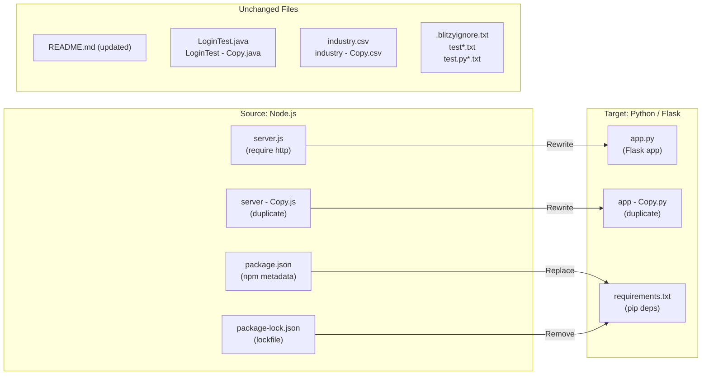

# Technical Specification

# 0. Agent Action Plan

## 0.1 Intent Clarification

### 0.1.1 Core Refactoring Objective

Based on the prompt, the Blitzy platform understands that the refactoring objective is to perform a **complete technology stack migration** of an existing Node.js HTTP server into a functionally identical Python 3 Flask web application. The migration must produce a Flask application that replicates every observable behavior of the original Node.js `server.js` — including HTTP response status codes, headers, body content, host binding, port binding, and startup logging — with zero behavioral deviation.

- **Refactoring type:** Tech stack migration (Node.js / CommonJS → Python 3 / Flask)
- **Target repository:** Same repository (in-place replacement of Node.js artifacts with Python equivalents)
- **Behavioral contract:** The rewritten Flask application must respond identically to any HTTP client that previously interacted with the Node.js server
- **Scope of "every feature and functionality":** All request handling (any HTTP method, any path), the exact response body `"Hello, World!\n"`, status code `200`, `Content-Type: text/plain`, binding to `127.0.0.1:3000`, and the startup console log message

The original Node.js server (`server.js`, 14 lines) uses only the built-in `http` module with zero external dependencies. The Flask replacement will introduce Flask as the sole external dependency, replacing the built-in `http` module with Flask's WSGI-based request routing.

### 0.1.2 Technical Interpretation

This refactoring translates to the following technical transformation strategy:

- **Runtime migration:** Node.js v20.x runtime → Python 3.12.x runtime
- **Framework introduction:** Built-in `http` module (no framework) → Flask 3.1.3 micro-framework
- **Module system change:** CommonJS (`require('http')`) → Python standard imports (`from flask import Flask`)
- **Package management change:** npm (`package.json` / `package-lock.json`) → pip (`requirements.txt`)
- **Server binding model:** `http.createServer().listen(port, hostname)` → `app.run(host, port)`
- **Routing model:** Implicit catch-all handler (callback on every request) → Flask catch-all route decorator (`@app.route`)
- **Response model:** `res.statusCode = 200; res.setHeader(); res.end()` → `flask.Response` or `make_response()`

**Implicit requirements surfaced:**
- The Flask application must handle ALL HTTP methods (GET, POST, PUT, DELETE, PATCH, HEAD, OPTIONS, etc.) on ALL paths, matching the Node.js server's universal handler behavior
- The response body must be exactly `"Hello, World!\n"` (14 bytes, including the trailing newline)
- The `Content-Type` header must be exactly `text/plain`
- The server must bind to `127.0.0.1` (not `0.0.0.0`) on port `3000`
- A startup message `Server running at http://127.0.0.1:3000/` must be printed to the console
- The duplicate file `server - Copy.js` must be replicated as an equivalent Python duplicate to maintain the repository's file-pairing pattern
- Non-Node.js files (Java stubs, CSV data, empty placeholders) must remain untouched

## 0.2 Source Analysis

### 0.2.1 Comprehensive Source File Discovery

The repository follows a completely flat directory structure with zero subfolders. All 14 files reside at the root level. The following inventory categorizes every file by its role in the migration.

**Current Structure:**
```
hao-backprop-test/ (root — flat, zero subfolders)
├── server.js                 (14 lines, 342 bytes — primary Node.js HTTP server)
├── server - Copy.js          (14 lines, 342 bytes — byte-identical duplicate of server.js)
├── package.json              (11 lines, 251 bytes — npm project metadata, zero dependencies)
├── package-lock.json         (13 lines, 247 bytes — lockfile, zero resolved packages)
├── README.md                 (2 lines, 73 bytes — project title and description)
├── LoginTest.java            (12 lines, 128 bytes — intentionally non-compilable Java stub)
├── LoginTest - Copy.java     (12 lines, 128 bytes — duplicate Java stub)
├── industry.csv              (44 lines, 749 bytes — 43-entry industry taxonomy CSV)
├── industry - Copy.csv       (44 lines, 749 bytes — duplicate CSV)
├── .blitzyignore.txt         (0 bytes — empty placeholder)
├── test.blitzyignore.txt     (0 bytes — empty placeholder)
├── test1.blitzyignore.txt    (0 bytes — empty placeholder)
├── test.py.txt               (0 bytes — empty placeholder)
└── test.py - Copy.txt        (0 bytes — empty placeholder)
```

### 0.2.2 Source File Classification

| File | Size | Category | Migration Role | MD5 Hash |
|------|------|----------|---------------|----------|
| `server.js` | 342 B | Node.js server code | **Primary migration target** — rewrite to Flask | `05576d40ab8d9f141d1073f784b26e1b` |
| `server - Copy.js` | 342 B | Node.js duplicate | **Secondary migration target** — create Python duplicate | `05576d40ab8d9f141d1073f784b26e1b` |
| `package.json` | 251 B | npm configuration | **Replace** with `requirements.txt` | — |
| `package-lock.json` | 247 B | npm lockfile | **Remove** — no direct Python equivalent needed | — |
| `README.md` | 73 B | Documentation | **Update** — reflect new Python/Flask stack | — |
| `LoginTest.java` | 128 B | Java test fixture | **Unchanged** — not part of Node.js server | — |
| `LoginTest - Copy.java` | 128 B | Java test fixture | **Unchanged** — not part of Node.js server | — |
| `industry.csv` | 749 B | Static data asset | **Unchanged** — language-agnostic data file | — |
| `industry - Copy.csv` | 749 B | Static data duplicate | **Unchanged** — language-agnostic data file | — |
| `.blitzyignore.txt` | 0 B | Empty placeholder | **Unchanged** — sentinel file | — |
| `test.blitzyignore.txt` | 0 B | Empty placeholder | **Unchanged** — sentinel file | — |
| `test1.blitzyignore.txt` | 0 B | Empty placeholder | **Unchanged** — sentinel file | — |
| `test.py.txt` | 0 B | Empty placeholder | **Unchanged** — sentinel file | — |
| `test.py - Copy.txt` | 0 B | Empty placeholder | **Unchanged** — sentinel file | — |

### 0.2.3 Primary Source: server.js — Behavioral Analysis

The sole functional code in the repository is `server.js`. Verified behavior through live testing:

- **Binding:** Listens on `127.0.0.1:3000` (loopback only)
- **Routing:** No route discrimination — every request (any method, any path) triggers the same handler
- **Response status:** `200 OK` for all requests
- **Response header:** `Content-Type: text/plain`
- **Response body:** `Hello, World!\n` (exactly 14 bytes, trailing newline included)
- **Startup log:** Prints `Server running at http://127.0.0.1:3000/` to stdout
- **Module system:** CommonJS (`require('http')`) — uses only the Node.js built-in `http` module
- **Dependencies:** Zero external packages — confirmed via `package.json` and `package-lock.json`

### 0.2.4 Configuration Source: package.json — Metadata Analysis

The `package.json` defines the npm project identity with the following fields:

- **name:** `hello_world`
- **version:** `1.0.0`
- **description:** `Hello world in Node.js`
- **main:** `index.js` (intentionally references a missing file — a deliberate test artifact)
- **scripts.test:** `echo "Error: no test specified" && exit 1` (deliberately failing test command)
- **author:** `hxu`
- **license:** `MIT`
- **dependencies:** None declared
- **devDependencies:** None declared

## 0.3 Scope Boundaries

### 0.3.1 Exhaustively In Scope

**Source transformations (Node.js → Python/Flask):**
- `server.js` — Full rewrite to Python Flask application (`app.py`)
- `server - Copy.js` — Recreate as Python duplicate (`app - Copy.py`) preserving the repository's copy-naming convention

**Package management migration:**
- `package.json` — Replace with `requirements.txt` for Python dependency declaration
- `package-lock.json` — Remove (superseded by `requirements.txt`; no lock file needed for a single-dependency project)

**Documentation updates:**
- `README.md` — Update to reflect Python 3 / Flask stack, revised run instructions, and project description

**Behavioral fidelity requirements:**
- HTTP response: status `200`, `Content-Type: text/plain`, body `Hello, World!\n` for all methods and all paths
- Server binding: `127.0.0.1:3000`
- Startup log: `Server running at http://127.0.0.1:3000/`
- Catch-all routing: every HTTP method and every URL path must return the identical response

**New file creation:**
- `app.py` — Primary Flask application (replaces `server.js`)
- `app - Copy.py` — Byte-identical duplicate of `app.py` (replaces `server - Copy.js`)
- `requirements.txt` — Python dependency manifest listing Flask and its version

### 0.3.2 Explicitly Out of Scope

The following files and concerns are explicitly excluded from this refactoring exercise:

**Non-Node.js repository files (unchanged):**
- `LoginTest.java` — Intentionally non-compilable Java stub; not part of the Node.js server
- `LoginTest - Copy.java` — Duplicate Java stub; not part of the Node.js server
- `industry.csv` — Language-agnostic static data asset
- `industry - Copy.csv` — Duplicate static data asset
- `.blitzyignore.txt` — Empty sentinel placeholder
- `test.blitzyignore.txt` — Empty sentinel placeholder
- `test1.blitzyignore.txt` — Empty sentinel placeholder
- `test.py.txt` — Empty sentinel placeholder
- `test.py - Copy.txt` — Empty sentinel placeholder

**Capabilities not being introduced:**
- No database connectivity, ORM, or persistence layer
- No authentication, authorization, or session management
- No REST API design, endpoint routing, or URL parameters
- No HTML templates, frontend UI, or static file serving
- No test framework integration (no pytest, unittest, or equivalent)
- No CI/CD pipeline configuration
- No containerization (Dockerfile, Docker Compose)
- No environment variable management or `.env` files
- No additional Flask extensions beyond the core Flask package

**Behavioral exclusions:**
- No changes to the HTTP response contract (status, headers, body must remain identical)
- No introduction of request logging, middleware, or error handlers beyond what the original Node.js server provides
- No modification to the host or port binding configuration

## 0.4 Target Design

### 0.4.1 Refactored Structure Planning

The target structure preserves the repository's flat directory layout (zero subfolders) while replacing all Node.js artifacts with Python/Flask equivalents. Non-Node.js files remain in place, unchanged.

**Target Architecture:**
```
hao-backprop-test/ (root — flat, zero subfolders)
├── app.py                    (NEW — Flask HTTP server, replaces server.js)
├── app - Copy.py             (NEW — byte-identical duplicate, replaces server - Copy.js)
├── requirements.txt          (NEW — Python dependency manifest, replaces package.json)
├── README.md                 (UPDATED — reflects Python/Flask stack)
├── LoginTest.java            (UNCHANGED)
├── LoginTest - Copy.java     (UNCHANGED)
├── industry.csv              (UNCHANGED)
├── industry - Copy.csv       (UNCHANGED)
├── .blitzyignore.txt         (UNCHANGED)
├── test.blitzyignore.txt     (UNCHANGED)
├── test1.blitzyignore.txt    (UNCHANGED)
├── test.py.txt               (UNCHANGED)
└── test.py - Copy.txt        (UNCHANGED)
```

**Files removed from repository:**
- `server.js` — Superseded by `app.py`
- `server - Copy.js` — Superseded by `app - Copy.py`
- `package.json` — Superseded by `requirements.txt`
- `package-lock.json` — No Python equivalent required

**Net file count change:** 14 files → 13 files (4 Node.js files removed, 3 Python files added)

### 0.4.2 Web Search Research Conducted

- **Flask latest stable version:** Flask 3.1.3 (released February 19, 2026) — confirmed via PyPI as the current production-stable release
- **Flask Python compatibility:** Flask 3.1.x supports Python 3.9 and newer; Python 3.12.3 (the environment runtime) is fully compatible
- **Flask catch-all routing:** Flask supports catch-all URL rules using the `<path:path>` converter combined with the `defaults` parameter to match the root path, enabling universal request handling that mirrors the Node.js `http.createServer` callback
- **Flask host/port binding:** `app.run(host='127.0.0.1', port=3000)` directly maps to the Node.js `server.listen(3000, '127.0.0.1')` call
- **WSGI response model:** Flask's `make_response()` or direct `Response` object creation allows precise control over status code, headers, and body content, matching the Node.js `res.statusCode`, `res.setHeader()`, and `res.end()` pattern

### 0.4.3 Design Pattern Applications

Given the extreme simplicity of the original Node.js server (14 lines, single handler, no routing logic), the Flask application requires minimal design patterns:

- **Single-module architecture:** The entire application resides in a single `app.py` file, mirroring the single-file `server.js` pattern. No module decomposition, blueprints, or factory pattern is necessary.
- **Catch-all route pattern:** A single route decorator with `methods` parameter accepting all HTTP verbs and a `<path:path>` variable rule captures every incoming request, replicating the Node.js universal handler callback.
- **Explicit response construction:** Using `flask.Response` with explicit `status`, `mimetype`, and body parameters ensures the response headers and body match the original Node.js output byte-for-byte.
- **Guard clause entry point:** The `if __name__ == '__main__':` block ensures the server only starts when executed directly, following Python best practices while matching the Node.js top-level execution model.

### 0.4.4 Transformation Architecture Diagram



## 0.5 Transformation Mapping

### 0.5.1 File-by-File Transformation Plan

The complete transformation is executed in **one phase** with no deferred work. Every target file is mapped to its corresponding source file.

| Target File | Transformation | Source File | Key Changes |
|-------------|---------------|-------------|-------------|
| `app.py` | CREATE | `server.js` | Rewrite Node.js HTTP server as Flask application. Replace `require('http')` with Flask imports. Replace `http.createServer` callback with `@app.route` catch-all. Replace `res.statusCode`/`res.setHeader`/`res.end` with `flask.Response`. Replace `server.listen()` with `app.run()`. Preserve host `127.0.0.1`, port `3000`, response body `Hello, World!\n`, status `200`, and `Content-Type: text/plain`. Print startup message. |
| `app - Copy.py` | CREATE | `server - Copy.js` | Byte-identical copy of `app.py`, preserving the repository's `" - Copy"` naming convention for duplicate-detection testing |
| `requirements.txt` | CREATE | `package.json` | Declare Flask dependency with pinned version `Flask==3.1.3`. Replaces npm metadata with pip-compatible format. Only Flask is listed (zero additional dependencies). |
| `README.md` | UPDATE | `README.md` | Update project title and description to reflect Python 3 / Flask stack. Replace any Node.js-specific references with Python equivalents. Preserve the repository's test-fixture purpose statement. |
| `server.js` | DELETE | — | Removed — superseded by `app.py` |
| `server - Copy.js` | DELETE | — | Removed — superseded by `app - Copy.py` |
| `package.json` | DELETE | — | Removed — superseded by `requirements.txt` |
| `package-lock.json` | DELETE | — | Removed — no Python equivalent needed |
| `LoginTest.java` | UNCHANGED | — | No changes — not part of Node.js server functionality |
| `LoginTest - Copy.java` | UNCHANGED | — | No changes — not part of Node.js server functionality |
| `industry.csv` | UNCHANGED | — | No changes — language-agnostic data asset |
| `industry - Copy.csv` | UNCHANGED | — | No changes — language-agnostic data asset |
| `.blitzyignore.txt` | UNCHANGED | — | No changes — empty sentinel file |
| `test.blitzyignore.txt` | UNCHANGED | — | No changes — empty sentinel file |
| `test1.blitzyignore.txt` | UNCHANGED | — | No changes — empty sentinel file |
| `test.py.txt` | UNCHANGED | — | No changes — empty sentinel file |
| `test.py - Copy.txt` | UNCHANGED | — | No changes — empty sentinel file |

### 0.5.2 Cross-File Dependencies

**Import statement transformations:**

The original Node.js server uses a single import:
- **FROM:** `const http = require('http');`
- **TO:** `from flask import Flask, Response`

No other files in the repository import from `server.js` or reference it programmatically. The migration therefore has **zero cross-file import ripple effects** — each file is self-contained.

**Configuration updates for new structure:**
- `requirements.txt` replaces `package.json` as the project's dependency manifest
- No build scripts, test scripts, or CI/CD pipelines reference `server.js`, so no external configuration needs updating
- The `package.json` field `"main": "index.js"` (which already pointed to a nonexistent file) has no Python equivalent and is intentionally not carried forward

**Startup command change:**
- **FROM:** `node server.js`
- **TO:** `python app.py`

### 0.5.3 Code Transformation Detail

**server.js → app.py line-by-line mapping:**

| Node.js (server.js) | Python/Flask (app.py) | Purpose |
|---------------------|----------------------|---------|
| `const http = require('http');` | `from flask import Flask, Response` | Module import |
| `const hostname = '127.0.0.1';` | `hostname = '127.0.0.1'` | Host constant |
| `const port = 3000;` | `port = 3000` | Port constant |
| `const server = http.createServer((req, res) => { ... });` | `@app.route('/', defaults={'path': ''}, methods=[...])` + `@app.route('/<path:path>', methods=[...])` | Catch-all route |
| `res.statusCode = 200;` | `Response(..., status=200, ...)` | Status code |
| `res.setHeader('Content-Type', 'text/plain');` | `Response(..., mimetype='text/plain')` | Content type |
| `res.end('Hello, World!\n');` | `Response('Hello, World!\n', ...)` | Response body |
| `server.listen(port, hostname, () => { ... });` | `app.run(host=hostname, port=port)` | Server start |
| `console.log(...)` | `print(...)` | Startup log |

### 0.5.4 Wildcard Patterns

No wildcard patterns are required for this migration. The repository contains a small, fixed set of files with no subdirectories or file-group patterns that would benefit from globbing. Every affected file is explicitly listed by name in the transformation table above.

### 0.5.5 One-Phase Execution

The entire refactoring is executed by Blitzy in **one phase**. All file creations, deletions, and updates occur atomically in a single pass. There is no phased rollout, no intermediate state, and no deferred work.

## 0.6 Dependency Inventory

### 0.6.1 Key Packages

The original Node.js project declares **zero external dependencies** — `package.json` contains no `dependencies` or `devDependencies` fields, and `package-lock.json` resolves zero packages. The sole import (`require('http')`) uses a Node.js built-in module.

The target Python/Flask project introduces **one direct dependency** (Flask) which brings six transitive dependencies automatically installed by pip:

| Registry | Package | Version | Purpose |
|----------|---------|---------|---------|
| PyPI | `Flask` | 3.1.3 | WSGI micro-framework — primary web application framework replacing Node.js built-in `http` module |
| PyPI | `Werkzeug` | 3.1.7 | WSGI toolkit — HTTP request/response handling, URL routing, and development server (auto-installed by Flask) |
| PyPI | `Jinja2` | 3.1.6 | Template engine (auto-installed by Flask; not used in this project but required by Flask core) |
| PyPI | `MarkupSafe` | 3.0.3 | Safe string escaping for Jinja2 (auto-installed; not directly used) |
| PyPI | `itsdangerous` | 2.2.0 | Data signing for session cookies (auto-installed by Flask; not used in this project) |
| PyPI | `click` | 8.3.1 | CLI framework for Flask command-line interface (auto-installed; not directly used) |
| PyPI | `blinker` | 1.9.0 | Signal support for Flask (auto-installed; not directly used) |

**Dependency manifest file (`requirements.txt`) content:**

Only the direct dependency is declared; transitive dependencies are resolved automatically by pip:
```
Flask==3.1.3
```

### 0.6.2 Dependency Changes

**Removed dependencies (Node.js ecosystem):**
- `package.json` — npm project manifest (deleted)
- `package-lock.json` — npm lockfile (deleted)
- Node.js built-in `http` module — replaced by Flask/Werkzeug WSGI stack

**Added dependencies (Python ecosystem):**
- `Flask==3.1.3` via `requirements.txt` — declared as the sole direct dependency
- All transitive dependencies (Werkzeug, Jinja2, MarkupSafe, itsdangerous, click, blinker) are installed automatically and do not need explicit pinning in `requirements.txt` for this minimal project

### 0.6.3 Import Refactoring

The migration involves a single import change with zero ripple effects across other files:

- **Old:** `const http = require('http');` in `server.js`
- **New:** `from flask import Flask, Response` in `app.py`
- **Apply to:** `app.py` and `app - Copy.py` only

No other files in the repository contain import statements or module references that would require updating.

### 0.6.4 External Reference Updates

| File | Update Required | Details |
|------|----------------|---------|
| `requirements.txt` | CREATE | New file declaring `Flask==3.1.3` |
| `README.md` | UPDATE | Replace `node server.js` run command with `python app.py`; update project description |
| `package.json` | DELETE | Removed — no longer applicable |
| `package-lock.json` | DELETE | Removed — no longer applicable |

## 0.7 Refactoring Rules

### 0.7.1 Behavioral Fidelity Rules

The following rules are derived from the user's directive to keep "every feature and functionality exactly as in the original Node.js project":

- **Response body:** The Flask application must return exactly `Hello, World!\n` (14 bytes with trailing newline `\n`). No additional whitespace, no missing newline, no encoding changes.
- **HTTP status code:** Every response must return status `200 OK` regardless of request method, path, or headers.
- **Content-Type header:** Every response must include `Content-Type: text/plain`. No additional content-type parameters (e.g., `charset=utf-8`) should be added unless they match the original Node.js behavior.
- **Universal handler:** The Flask application must handle ALL HTTP methods (GET, POST, PUT, DELETE, PATCH, HEAD, OPTIONS, and any other method) on ALL URL paths (including `/`, `/any/path`, `/any/nested/path/here`). No request should result in a `404 Not Found` or `405 Method Not Allowed`.
- **Host and port binding:** The server must bind to `127.0.0.1` on port `3000`, matching the Node.js configuration exactly.
- **Startup logging:** The application must print `Server running at http://127.0.0.1:3000/` to stdout on startup.
- **No additional behavior:** The Flask application must not introduce routing, request logging, error pages, middleware, or any behavior not present in the original `server.js`.

### 0.7.2 Structural Preservation Rules

- **Flat directory structure:** The target repository must maintain zero subfolders. All files remain at the root level.
- **Duplicate file convention:** The `" - Copy"` naming pattern must be preserved. `app - Copy.py` must be a byte-identical copy of `app.py`, just as `server - Copy.js` is a byte-identical copy of `server.js`.
- **Non-Node.js file integrity:** All Java stubs, CSV data files, empty placeholder files, and blitzyignore sentinels must remain completely untouched with no modifications to content, name, or metadata.

### 0.7.3 Special Instructions and Constraints

- **User-specified implementation rule:** `npm create` — This references the npm project scaffolding convention. In the Python/Flask context, the equivalent project initialization is achieved through `pip install Flask` and creation of `requirements.txt` plus the main application file. The target project must follow standard Python project initialization practices.
- **No phased migration:** The entire refactoring is executed in a single pass. No intermediate states, no partial migration, no backward-compatible bridge code.
- **No test framework introduction:** The original project has no functional tests (`npm test` deliberately fails). The Flask project should similarly not introduce a test framework unless the user requests it.
- **Preserve deliberate imperfections:** The original `package.json` references `"main": "index.js"` which does not exist — this is an intentional test artifact. The Python migration does not need to replicate this specific imperfection, but it should not introduce new functionality that was not present in the original.

## 0.8 References

### 0.8.1 Repository Files Searched

The following files were retrieved and analyzed during the preparation of this Agent Action Plan:

| File | Lines | Purpose of Inspection |
|------|-------|-----------------------|
| `server.js` | 14 | Primary migration target — analyzed HTTP server behavior, module imports, host/port binding, response construction, and startup logging |
| `server - Copy.js` | 14 | Confirmed byte-identical duplicate of `server.js` (MD5: `05576d40ab8d9f141d1073f784b26e1b`) — verified the `" - Copy"` naming convention |
| `package.json` | 11 | Extracted npm project metadata (name, version, description, author, license), confirmed zero dependencies, noted intentional `"main": "index.js"` misconfiguration |
| `package-lock.json` | 13 | Confirmed lockfileVersion 3 with zero resolved packages — verified complete absence of external dependencies |
| `README.md` | 2 | Read project title (`hao-backprop-test`) and description ("test project for backprop integration. Do not touch!") |
| `LoginTest.java` | 12 | Confirmed intentionally non-compilable Java stub — classified as out-of-scope for migration |
| `LoginTest - Copy.java` | 12 | Confirmed duplicate Java stub — classified as out-of-scope for migration |
| `industry.csv` | 44 | Confirmed 43-entry industry taxonomy CSV — classified as unchanged data asset |
| `industry - Copy.csv` | 44 | Confirmed duplicate CSV — classified as unchanged data asset |
| `.blitzyignore.txt` | 0 | Confirmed empty (zero bytes) — no ignore patterns to enforce |
| `test.blitzyignore.txt` | 0 | Confirmed empty (zero bytes) — sentinel placeholder |
| `test1.blitzyignore.txt` | 0 | Confirmed empty (zero bytes) — sentinel placeholder |
| `test.py.txt` | 0 | Confirmed empty (zero bytes) — sentinel placeholder |
| `test.py - Copy.txt` | 0 | Confirmed empty (zero bytes) — sentinel placeholder |

### 0.8.2 Technical Specification Sections Referenced

| Section | Purpose |
|---------|---------|
| 1.1 Executive Summary | Understood project classification as a test fixture for backprop integration |
| 1.2 System Overview | Reviewed component inventory, integration patterns, and the flat directory architecture |
| 1.3 Scope | Identified in-scope features (HTTP server, multi-language files) and out-of-scope exclusions (no databases, no CI/CD, no tests) |
| 3.1 Technology Stack Overview | Confirmed Node.js ≥15, CommonJS, zero-dependency mandate, and governing constraints C-001 through C-003 |
| 3.3 Frameworks & Libraries | Verified zero-framework and zero-library state through eight independent data points |
| 5.1 High-Level Architecture | Reviewed flat artifact collection architecture and filesystem-mediated integration pattern |
| 5.2 Component Details | Analyzed server.js behavioral specification (status, headers, body, binding) and negative test artifacts |
| 6.1 Core Services Architecture | Confirmed no service architecture — static fixture with read-only filesystem interface |

### 0.8.3 External Sources Consulted

| Source | URL | Information Retrieved |
|--------|-----|----------------------|
| Flask — PyPI | https://pypi.org/project/Flask/ | Latest stable version: 3.1.3 (released Feb 19, 2026); Python 3.9+ support confirmed |
| Flask Documentation — Installation | https://flask.palletsprojects.com/en/stable/installation/ | Flask dependencies (Werkzeug, Jinja2, MarkupSafe, itsdangerous, click, blinker) and Python version requirements |
| Flask GitHub Releases | https://github.com/pallets/flask/releases | Release history and changelog for version verification |

### 0.8.4 Live Verification Tests Performed

| Test | Command | Result |
|------|---------|--------|
| Node.js server GET `/` | `curl -sD - http://127.0.0.1:3000/` | HTTP 200, `Content-Type: text/plain`, body `Hello, World!\n` |
| Node.js server GET `/some/path` | `curl -sD - http://127.0.0.1:3000/some/path` | HTTP 200, identical response — confirms universal handler |
| Node.js server POST `/` | `curl -sD - -X POST http://127.0.0.1:3000/` | HTTP 200, identical response — confirms method-agnostic handling |
| Startup log | `node server.js` | Printed `Server running at http://127.0.0.1:3000/` to stdout |
| Duplicate file verification | `md5sum server.js "server - Copy.js"` | Both files: `05576d40ab8d9f141d1073f784b26e1b` — byte-identical |

### 0.8.5 Attachments

No external attachments (Figma URLs, design files, or supplementary documents) were provided for this project.

